
# All images in the ../media library
Hover over the image to display the name of the file in which it is located.

## Media

## msportalfx-test

Update the following image to a standard size.

Update the following image to a standard size.

Update the following image to a standard size.

Update the following image to a standard size.
Update the following image to include a fictitious name. 

## portalfx

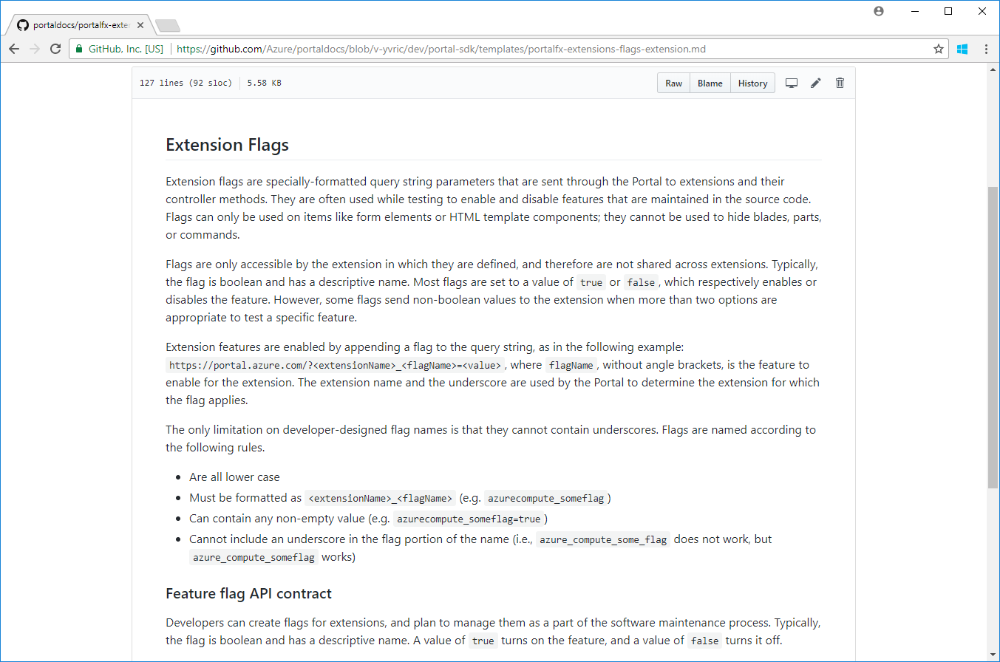

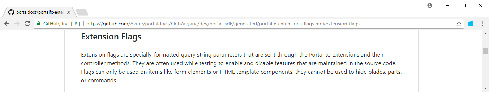

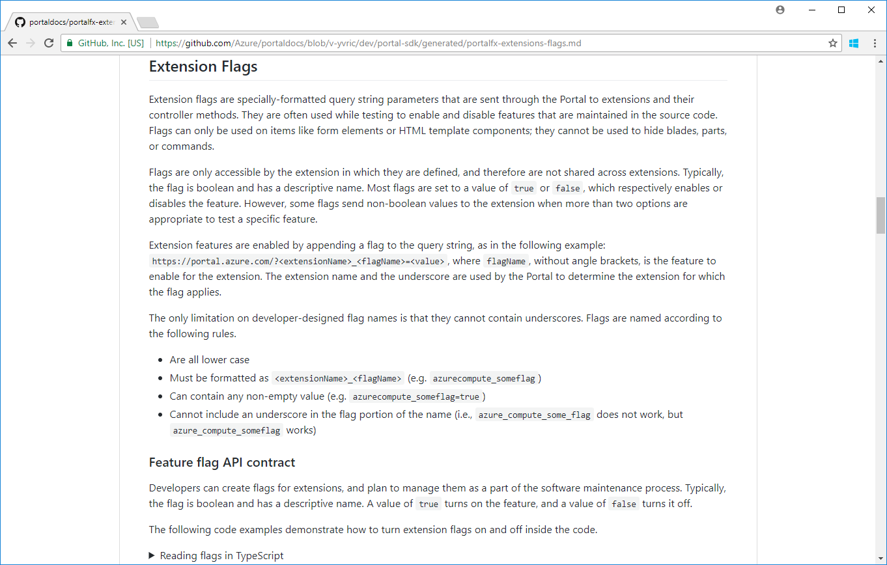

## portalfx-bladeKinds

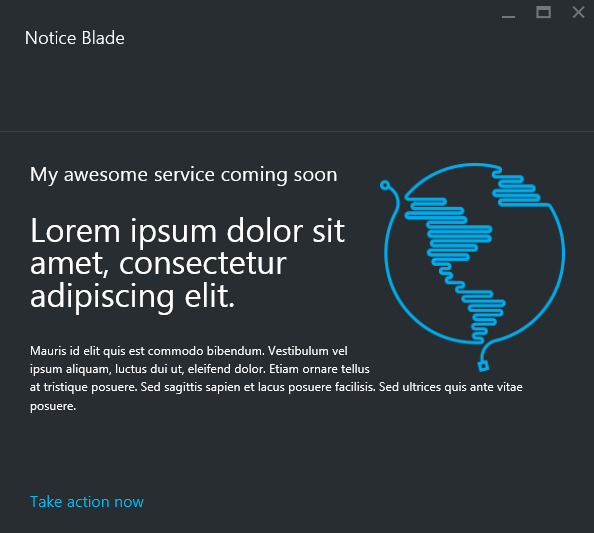

Update the following image to remove the word "me"

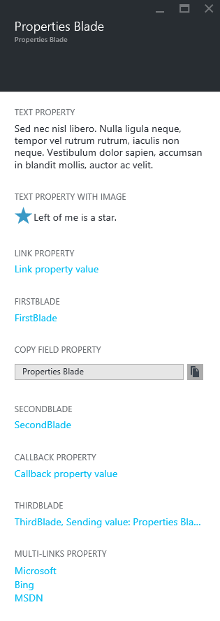

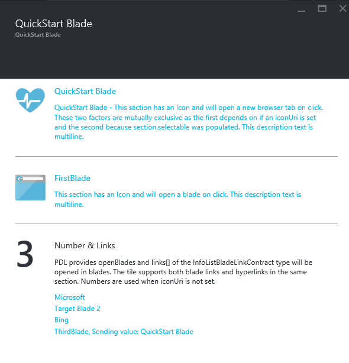

## portalfx-blades

Update the following image to a more current blade and associated website.

Update the following image to include a fictitious name.

Update the following image to include a fictitious name.

Update the following image to a more current blade and associated website.

## portalfx-blade-viewmodel

## portalfx-browse

## portalfx-commands

Update the following image to include  a fictitious name.

Update the following image to include  a fictitious name.

Update the following image to include  a fictitious name.

## portalfx-controls

Update the following image to include  a fictitious name.

Update the following image to a more current blade and associated website.

Update the following image to a standard size.

Update the following image to a standard size.

Update the following image to a standard size.

## portalfx-controls-monitor-chart

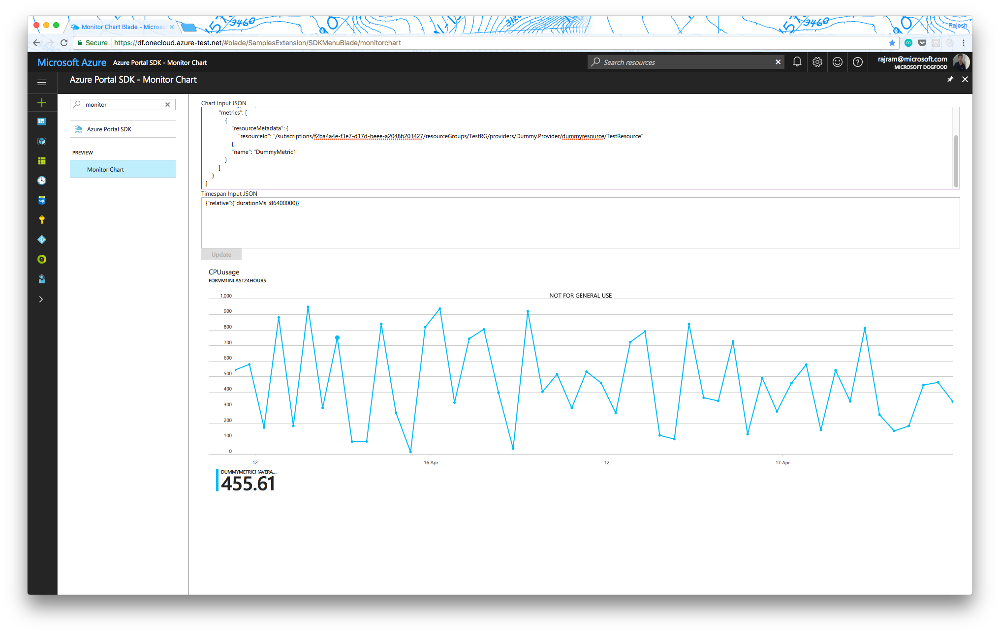

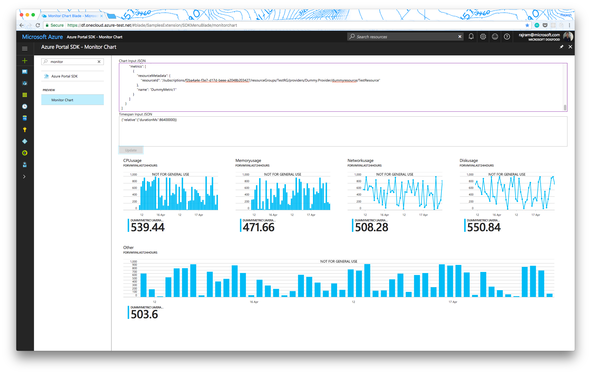

## portalfx-create

## portalfx-create-deploytoazure

## portalfx-data

## portalfx-data-context

## portalfx-debugging

## portalfx-deployment

## portalfx-essentials

## portalfx-extensions-branches

## portalfx-extensions-developmentPhases

## portalfx-extensions-helloWorld

## portalfx-extensions-hosting-service

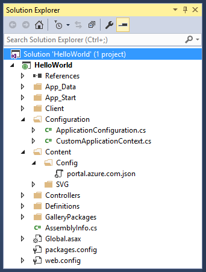

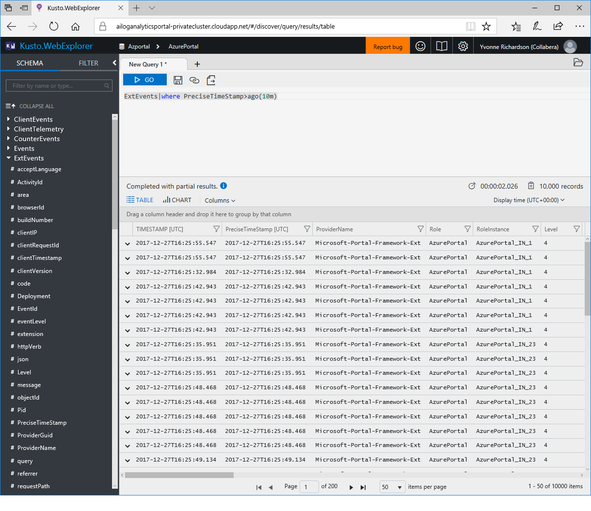

## portalfx-extensions-onboarding

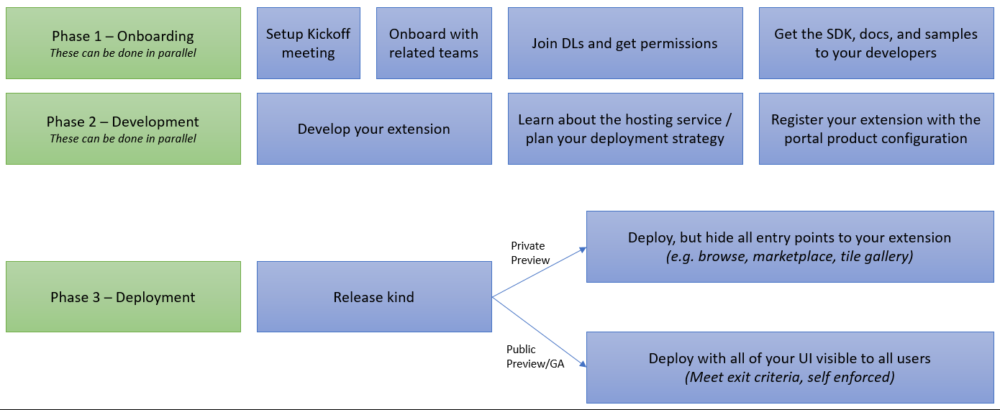

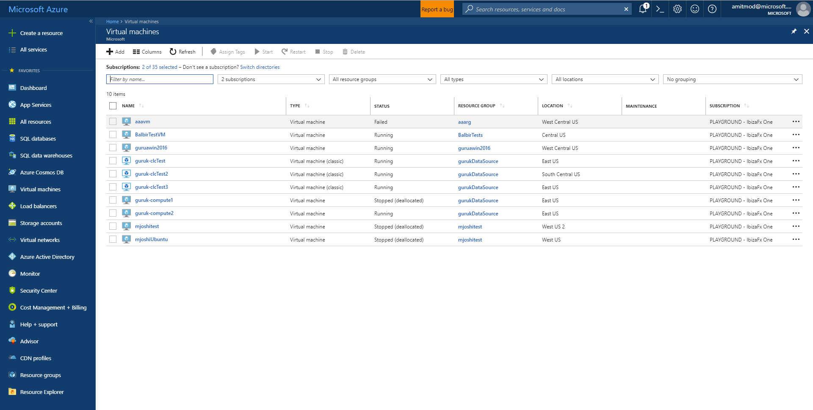

## portalfx-extensions-publishing

## portalfx-extensions-samples

## portalfx-forms

## portalfx-forms-field-validation

## portalfx-forms-sections

## portalfx-icons

## portalfx-ide-setup

## portalfx-internal

## portalfx-lens

## portalfx-notifications

## portalfx-overview

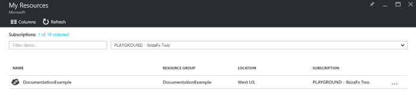

## portalfx-parameter-collection-overview

## portalfx-parts

## portalfx-pde

## portalfx-performance

## portalfx-style-guide

## portalfx-tags

## portalfx-telemetry

## portalfx-testinprod

## portalfx-ui-concepts

## portalfx-ux-add-columns

## portalfx-ux-assetpart

## portalfx-ux-commands

## portalfx-ux-create-forms

## portalfx-ux-create-forms

## portalfx-ux-create-from-browse

## portalfx-ux-displaying-legal-terms

## portalfx-ux-dropdowns-vs-pickers

## portalfx-ux-essentials

## portalfx-ux-forms

## portalfx-ux-gallery

## portalfx-ux-inblade-notifications

## portalfx-ux-pricing-tier

## portalfx-ux-resource-blade

## portalfx-ux-settings

## portalfx-ux-show-commands

## portalfx-ux-tiles

## portalfx-ux-using-pricing-tier

## top-extensions-getting-started

## videos

