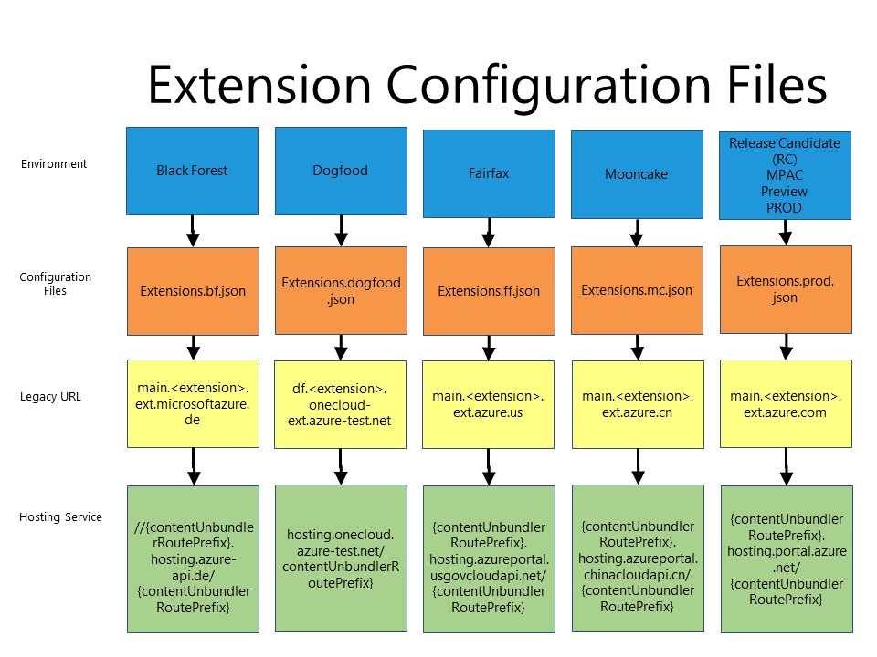

## Creating CNAMEs
 Extension URLs use a standard CNAME pattern. Extensions that host themselves follow the CNAME naming pattern, and extensions that use a hosting service use the hosting service name convention. CNAMEs for hosting services are managed by the Ibiza team. 
 
 The CNAMEs that are created are unique for each environment, and use the formats that are specified in the following table, which describes the URL format and the hosting service name convention for each environment.

| Portal Environment	| Legacy URL | Configuration File  | Hosting Service |
| --- | --- |  --- | --- |
| **DOGFOOD**	| df.{extension}.onecloud-ext.azure-test.net |   [Extensions.dogfood.json](https://msazure.visualstudio.com/One/Azure%20Portal/_git/AzureUX-PortalFx?_a=contents&path=%2Fsrc%2FRDPackages%2FOneCloud%2FExtensions.dogfood.json&version=GBdev)  |`//hosting.onecloud.azure-test.net/{contentUnbundlerRoutePrefix}` |
| **RC, MPAC, Preview, PROD** 	| 	main.{extension}.ext.azure.com | [Extensions.prod.json](https://msazure.visualstudio.com/One/Azure%20Portal/_git/AzureUX-PortalFx?_a=contents&path=%2Fsrc%2FRDPackages%2FOneCloud%2FExtensions.prod.json&version=GBdev) 	| {contentUnbundlerRoutePrefix}.hosting.portal.azure.net/{contentUnbundlerRoutePrefix} |
| **BLACKFOREST**	| main.{extension}.ext.microsoftazure.de | [Extensions.bf.json](https://msazure.visualstudio.com/One/Azure%20Portal/_git/AzureUX-PortalFx?_a=contents&path=%2Fsrc%2FRDPackages%2FOneCloud%2FExtensions.bf.json&version=GBdev)    |  //{contentUnbundlerRoutePrefix}.hosting.azure-api.de/{contentUnbundlerRoutePrefix} |
| **FAIRFAX**		| main.{extension}.ext.azure.us | [Extensions.ff.json](https://msazure.visualstudio.com/One/Azure%20Portal/_git/AzureUX-PortalFx?_a=contents&path=%2Fsrc%2FRDPackages%2FOneCloud%2FExtensions.ff.json&version=GBdev)   |  {contentUnbundlerRoutePrefix}.hosting.azureportal.usgovcloudapi.net/{contentUnbundlerRoutePrefix |
| **MOONCAKE**		| main.{extension}.ext.azure.cn | [Extensions.mc.json](https://msazure.visualstudio.com/One/Azure%20Portal/_git/AzureUX-PortalFx?_a=contents&path=%2Fsrc%2FRDPackages%2FOneCloud%2FExtensions.mc.json&version=GBdev)    | {contentUnbundlerRoutePrefix}.hosting.azureportal.chinacloudapi.cn/{contentUnbundlerRoutePrefix} |                  |

**NOTE** The RC, MPAC, Preview, and PROD environments all share the same `Extensions.prod.json` file for configuration; therefore you can only have one entry for your extension across all these environments. 

The relationship between the environments and the configuration files is in the following diagram.

 

### Dogfood and Production CNAMEs
You can create DOGFOOD/PROD CNAMEs using the Azure DNS that is located at
 [https://azure.microsoft.com/en-us/services/dns/](https://azure.microsoft.com/en-us/services/dns/). Its documentation is located at  [https://docs.microsoft.com/en-us/azure/dns/dns-getstarted-portal](https://docs.microsoft.com/en-us/azure/dns/dns-getstarted-portal).  You can also use any DNS hosting system.

The PROD CNAME is used for RC, MPAC, Preview and PROD environments.

### National Clouds
Create National Cloud CNAMEs using the process specified in each cloud.  For more information, search for "DNS" on their wiki pages, as described in the following table.
 | CLOUD | LOCATION |
 | --- | --- |
 | Fairfax | [https://aka.ms/fairfax](https://aka.ms/fairfax) |
 | Blackforest  | [https://aka.ms/blackforest](https://aka.ms/blackforest)  |
 | Mooncake | [https://aka.ms/mooncake](https://aka.ms/mooncake) |
 

## Glossary

 [portalfx-extensions-cnames-glossary.md](portalfx-extensions-cnames-glossary.md)