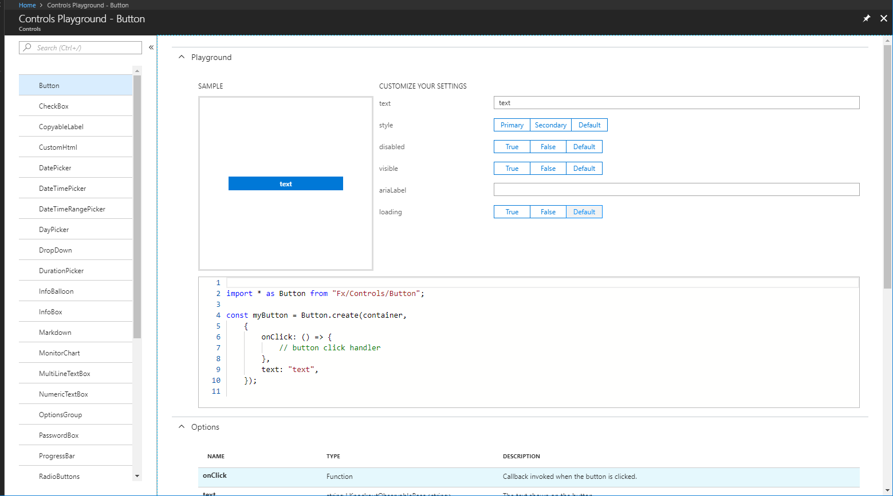

## The controls Playground

The controls playground is located at [https://aka.ms/portalfx/playground](https://aka.ms/portalfx/playground), and it provides a space where developers can experiment with controls previous to adding them to an extension. They can see what a control looks like, and how it behaves. The following is a working instance of a control.

You can quickly provide options for primitive types and enumerations.  This lets you configure working instance for basic scenarios.

Code snippets based off of the latest programming model:
 
The following code was generated by the playground to implement the preceding sample. 

**NOTE**: You will still need to edit this in your extension for localization purposes.

A quick reference for both the options and the contract of the control:
 

You quickly see every property you can pass into the options object, as well as every property on the object you get back out.

FAQ:
Q:  If I run into any problems using it or the new control viewmodels, who do I ask? 
A:  For control viewmodel issues, please post on stack overflow.  For specific playground extension issues or general playground extension feedback, please reach out to ibizacontrols@microsoft.com or myself directly at eriwong@microsoft.com

Q:  Why can’t I type code directly into the editor?
A:  We aren’t able to execute code provided by the user due to security concerns.  We are looking into how we can mitigate that, but for now, the code snippet is for your reference only.

Q: Why aren’t all of the new controls in the playground?
A:  The code for the playground extension is generated from Fx.d.ts.  Some of the controls require configuration beyond what we can infer.  We have a few ideas we’re playing around with to remedy this, so stay tuned. 

Q: No localization?
A: Localization is done at build times, so none of the string inputs are localized.  We considered faking the localized properties, but thought it would be better to just pass the strings through in non-localized forms so that copy/pasted code compiles and runs without any other work.
