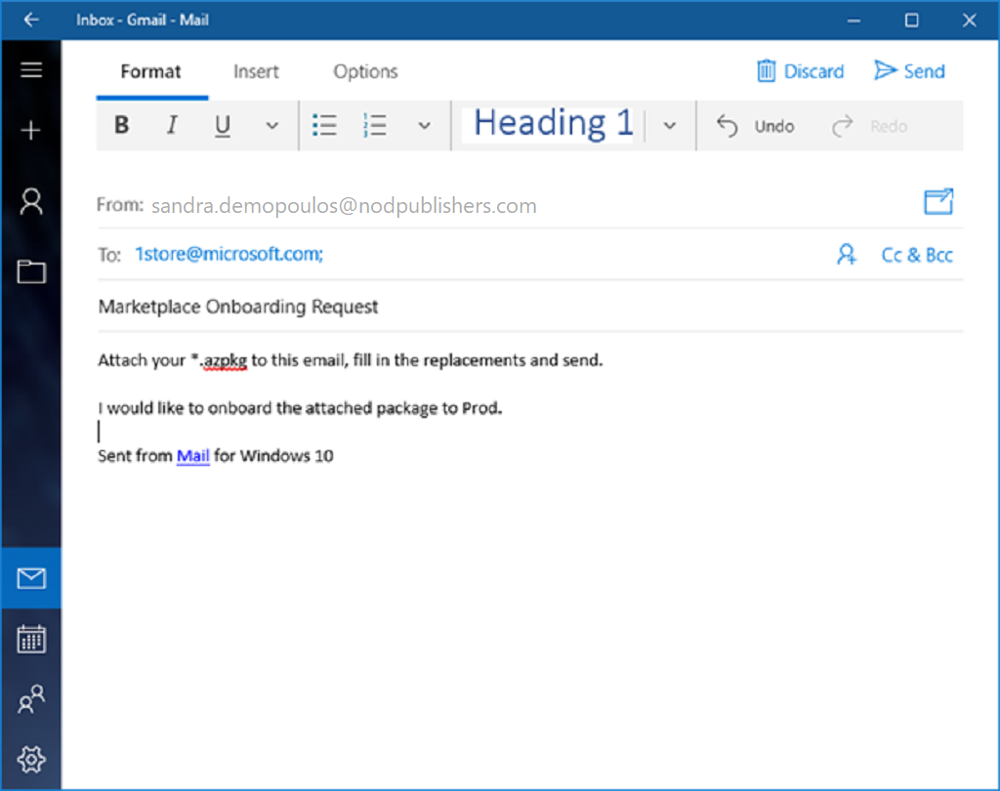
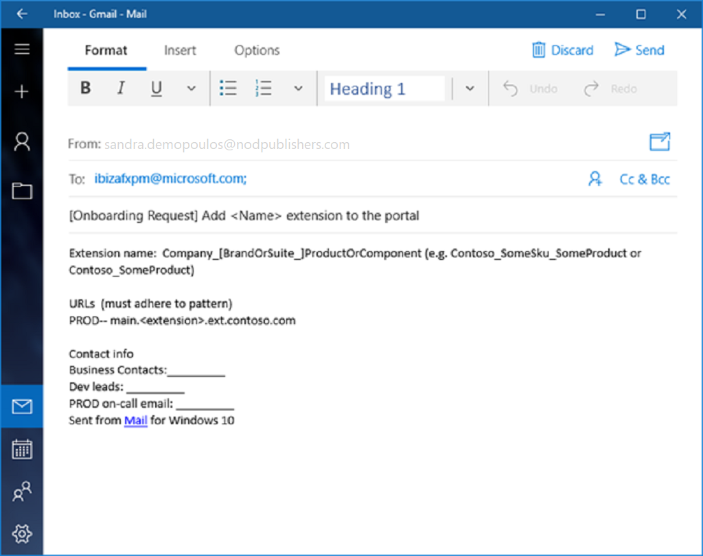

<a name="development-procedures"></a>
## Development Procedures

The items that are being developed add functionality to an Azure Portal, and therefore are named extensions.  Some examples are in the following image.

 

Perform the following tasks to become part of Azure portal extension developer community.

1. Join DLs and request permissions by using the document located at [portalfx-extensions-permissions.md](portalfx-extensions-permissions.md).

1. [Install Software](#install-software)

1. [Schedule Kickoff Meetings](#schedule-kickoff-meetings)

1. [Review Technical Guidance](#review-technical-guidance)

1. [Develop and deploy the extension](#develop-and-deploy-the-extension)

1. [Register the extension](#register-the-extension)

<a name="development-procedures-install-software"></a>
### Install Software
   
Install the following software. Your team should be aware of the most current download locations so that you can complete your own installs.

* Windows 8, Windows Server 2012 R2, or the most recent edition of the client or server platform. Some downloads are located at the following sites.
  * Windows 8
    
    [https://www.microsoft.com/en-us/software-download/windows8](https://www.microsoft.com/en-us/software-download/windows8)

  * Windows Server 2012 R2

    [https://www.microsoft.com/en-us/download/details.aspx?id=41703](https://www.microsoft.com/en-us/download/details.aspx?id=41703)

* Visual Studio 2015 that is located at [https://www.visualstudio.com/downloads/](https://www.visualstudio.com/downloads/)

* Typescript for Visual Studio 15 that is located at [https://www.microsoft.com/en-us/download/details.aspx?id=48593](https://www.microsoft.com/en-us/download/details.aspx?id=48593)

* Knockout that is located at [http://knockoutjs.com/downloads/](http://knockoutjs.com/downloads/)

* Azure Portal SDK that is located at [http://aka.ms/portalfx/download](http://aka.ms/portalfx/download)

* Quality Essentials that is located at [http://qe](http://qe), or One Compliance System (1CS) that is located at  [https://microsoft.sharepoint.com/teams/1CS/SitePages/Home.aspx](https://microsoft.sharepoint.com/teams/1CS/SitePages/Home.aspx)

* Set up the source code management system on your computer. Teams use **GitHub**, **VSO**, and other content management systems. Which one is used by your team is team-dependent.

Test that your computer is ready for Azure development by creating a blank extension, as specified in [portalfx-extensions-developerInit-procedure.md](portalfx-extensions-developerInit-procedure.md).

<a name="development-procedures-schedule-kickoff-meetings"></a>
### Schedule Kickoff Meetings

Schedule and attend the kickoff meeting(s) hosted by your PM or Dev Lead. These meetings will touch on the following points.
* Whether the service will target public Azure, on-premises, or both
* What is the name of the service
* Summary of the service and target scenarios

If you are planning to build a first party application, i.e., you are a part of Microsoft, the meeting agenda will also include:
* VP, PM, and engineering owners
* Timelines (preview, GA)

<a name="development-procedures-review-technical-guidance"></a>
### Review Technical Guidance

Read the following documents from the Azure Portal UI team site.  Our doc site provides technical guidance for use while you are building an extension.

| Function                                      | Title and Link |
| ---                                           | --- |
| Guidance for Program Managers and Dev Leads   | Portal Extensions for Program Managers, located at [portalfx-extensions-forProgramManagers.md](portalfx-extensions-forProgramManagers.md) |
| Private Preview, Public Preview, and GA       | Portal Extension Development Phases, located at [portalfx-extensions-developmentPhases.md](portalfx-extensions-developmentPhases.md) |
| How it Works	                                | Getting Started, located at [portalfx-howitworks.md#getting-started](portalfx-howitworks.md#getting-started)
| Build an empty extension                      | Creating An Extension, located at [portalfx-extensions-developerInit.md](portalfx-extensions-developerInit.md) |
| Experiment with sample code	                  | Sample Extensions, located at [portalfx-extensions-samples.md](portalfx-extensions-samples.md) |

<a name="development-procedures-develop-and-deploy-the-extension"></a>
### Develop and deploy the extension
 
1. Many extensions have been made more successful by setting up early design reviews with the Azure portal team. Taking the time to review the design gives extension owners an opportunity to understand how they can leverage Azure portal design patterns, and ensure that the desired outcome is feasible. When you are ready to build the extension, schedule a UX feasibility review with the Ibiza team UX contact by emailing ibiza-onboarding@microsoft.com and including “Extension Feasibility Review” in the subject line of the e-mail.

1.	If the extension requires additional built-in support for standard Graph or ARM APIs, submit a partner request at the site located at [https://feedback.azure.com/forums/594979-ibiza-partners](https://feedback.azure.com/forums/594979-ibiza-partners). 

1.	When you build the extension, remember to sideload it for local testing. Sideloading allows the testing and debugging of the extension locally against any environment. This is the preferred method of testing. For more information about sideloading, see [portalfx-extensions-sideloading-overview.md](portalfx-extensions-sideloading-overview.md) and [portalfx-testinprod.md](portalfx-testinprod.md).

1. Complete the development and unit testing of the extension. For more information on debugging, see [portalfx-debugging.md](portalfx-debugging.md) and [portalfx-extensions-testing-in-production.md](portalfx-extensions-testing-in-production.md).

1.	When you are confident that the development of the extension is complete, you should execute the following process so the specific work required for the Azure Fundamental tenets appears in Service360, as specified in [Azure Fundamentals](https://microsoft.sharepoint.com/teams/WAG/EngSys/Shared%20Documents/Argon/Azure%20Fundamentals%20Proposal/Azure%20Fundamentals%20Proposal.docx?d=wf5b821bc31c44042adb55ebf4d8b408d). 
    * Add the service to ServiceTree, which is located at [https://servicetree.msftcloudes.com](https://servicetree.msftcloudes.com)
    * Make the service be "Active" in ServiceTree
    * Complete metadata in ServiceTree to enable the automation for various Service360 Action Items
    * Complete the Action Items identified in Service360, which is located at [http://aka.ms/s360](http://aka.ms/s360)
1.	Address the exit criteria to meet previous to moving the extension to the next development phase. The exit criteria are located at [portalfx-extensions-exitCriteria.md](portalfx-extensions-exitCriteria.md).

1. Create configuration files for the extension as specified in [portalfx-extensions-configuration-overview.md](portalfx-extensions-configuration-overview.md).

1. 	Integrate the extension into the Marketplace. 

    In the following images, each icon in the Azure Portal Marketplace is referred to as a Gallery item. Gallery items take the form of a file with the .azpkg extension. This is a  zip file which contains all assets for the gallery item: icons, screenshots, descriptions.

    

    * **PROD:** The Marketplace team accepts fully finished .azkpg files from your team and uploads them to Production to onboard the gallery package. Send the following email to 1store@microsoft.com.  The subject line should contain “Marketplace Onboarding Request” and the *.azpkg file should be attached to the email, as in the following image.

      

    * **DOGFOOD:** Use AzureGallery.exe to upload items to DOGFOOD using the following command:

      ```AzureGallery.exe upload -p ..\path\to\package.azpkg -h [optional hide key]```

    In order to use the gallery loader, there are some values to set in the AzureGallery.exe.config file. For more information, see the Gallery Item Specifications document that is located at      [https://github.com/Azure/portaldocs/blob/master/gallery-sdk/generated/index-gallery.md#gallery-item-specificiations](https://github.com/Azure/portaldocs/blob/master/gallery-sdk/generated/index-gallery.md#gallery-item-specificiations).  

    For more dev/test scenarios, see [https://github.com/Azure/portaldocs/blob/master/gallery-sdk/generated/index-gallery.md#gallery-package-development-and-debugging-testing-in-production](https://github.com/Azure/portaldocs/blob/master/gallery-sdk/generated/index-gallery.md#gallery-package-development-and-debugging-testing-in-production).

<a name="development-procedures-register-the-extension"></a>
### Register the extension

Once the name of the extension or service name is finalized, request to have the extension registered in all environments. Registering an extension in Portal requires deployment so it can take almost 10 days in the Production environment. Please plan accordingly.

* For internal partners, the request to register an extension is a pull request, as specified in [portalfx-extensions-publishing.md](portalfx-extensions-publishing.md).
 
* External teams can submit their requests by sending an email that resembles the following image.

  
 
* After deploying the extension to the DOGFOOD (DF) environment, contact the Fx team to request that they enable the extension, if applicable. Every extension  meets required exit criteria / quality metrics before it will be enabled. The  extension will be enabled in production once all exit criteria have been met.

   Extension names must use standard extension name format, as in the example located at [portalfx-extensions-configuration-overview.md#name](portalfx-extensions-configuration-overview.md#name).

* Extension URLs must use a standard CNAME pattern. For more information about CNAMES, see [portalfx-extensions-cnames.md](portalfx-extensions-cnames.md).
