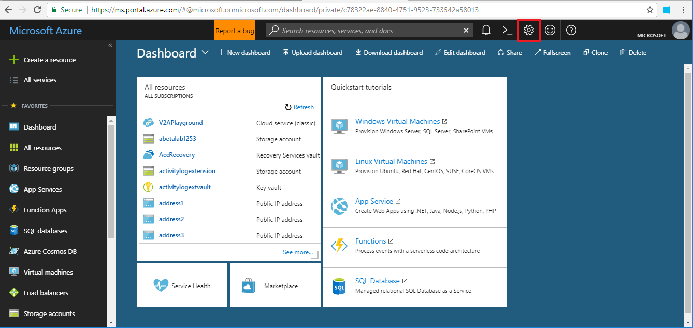

## Overview

When a user logs in to http://portal.azure.com, they are presented with the following screen.

The user should use the settings gear in the top-right of the screen to display their settings for the Portal, as in the following image.

The user settings are as follows.

* Restore default settings

    Clicking on this item will restore the user experience to the Portal defaults.

* Export all settings

    Clicking on this item will create a .json file that contains the user settings.  The user can save the file in the **File Open** document dialog, or manipulate it as appropriate.  It contains settings like the dashboard theme.  For example, double-clicking on the Portal dashboard will change the theme colors.

* Delete all settings and private dashboards

    Clicking on this item will delete all links to private dashboards and other user customizations to the Portal dashboard.

For more information about the Azure Portal, see [Stackoverflow](https://stackoverflow.microsoft.com).