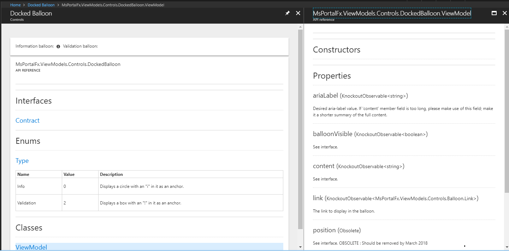

<a name="extension-controls"></a>
# Extension Controls

<a name="extension-controls-overview"></a>
## Overview

Controls are the building blocks of the Azure extension experience. They allow users to view, edit, and analyze data.

The Azure Portal team ships sample code that extension developers can leverage. All developers who install the Portal Framework SDK that is located at [http://aka.ms/portalfx/download](http://aka.ms/portalfx/download) also install the samples on their computers during the installation process. The source for the samples is located in the `Documents\PortalSDK\FrameworkPortal\Extensions\SamplesExtension` folder. The source specifies the namespace in which the control is located. 

Developers can view working copies of  sample controls in the Dogfood environment, which is located at [https://df.onecloud.azure-test.net/#blade/SamplesExtension/SDKMenuBlade/controls](https://df.onecloud.azure-test.net/#blade/SamplesExtension/SDKMenuBlade/controls). This site also contains links to working copies of individual controls. In some instances, controls describe the properties that they use in various interfaces, as in the following image.



First-party extension developers, i.e. Microsoft employees, have access to the Dogfood environment, therefore they can view the samples that are located at [https://aka.ms/portalfx/viewSamples](https://aka.ms/portalfx/viewSamples).

They can also access the controls playground located at [https://aka.ms/portalfx/playground](https://aka.ms/portalfx/playground), which allows them to build their own code instead of using the provided samples.

The Azure components of a UI experience are documented several ways. 
* There may be a document that provides specific guidance about the component, in terms of what it is, what it does, or how it is used. 
* The location of the sample code is included so that the developer can view the source for the component, or modify it as appropriate for the extensions they develop.  
* A working copy of the component can be viewed in the Dogfood environment or the controls playground.

<a name="extension-controls-procedure"></a>
## Procedure

To use a control, there are basically three steps. The following example demonstrates the three steps in **C#**; the three steps still occur in **Typescript**, but they may be programmed slightly differently.

<!-- TODO: Determine whether the import statement is an alternative to referencing the control in the PDL in order to connect it to the extension, and if so, when.   -->

1. The control is used by importing the module, as in the following code.

   ```c#
    import * as <control>  from "Fx/Controls/<control> ";
   ```

   where
		   
	`<control>`  is the name of the control, for example, infoBox.

    In some instances, the control is connected to the extension by being referenced in the pdl file, instead of importing the module for the control.
    
	
1. Change the link element in the HTML template to a control container.

    ```html
    <div>This is an example template blade that shows a link.</div>

    <div data-bind="pcControl:infoBox"></div>
    ```

1. Then, create the ViewModel in the code.

   ```c#
   public infoBox: infoBox.Contract;

   this.infoBox = infoBox.create(container, {
       label: "someLabel"
       //Other options...
   });

   ```

The ViewModel can be created by experimenting with controls in the playground located at  [https://aka.ms/portalfx/playground](https://aka.ms/portalfx/playground) and the samples located at [https://aka.ms/portalfx/viewSamples](https://aka.ms/portalfx/viewSamples). Alternatively, an extension can be developed by using the samples located at  `<dir>\Client\V1\Controls` or `<dir>\Client\V2\Controls\`, where `<dir>` is the `SamplesExtension\Extension\` directory, based on where the samples were installed when the developer set up the SDK.


<a name="extension-controls-the-controls-playground"></a>
## The controls playground

The controls playground is located at [https://aka.ms/portalfx/playground](https://aka.ms/portalfx/playground), and it provides a space where developers can experiment with controls previous to adding them to an extension. They can see what a control looks like, and how it behaves. The following is a working instance of a control.


You can quickly provide options for primitive types and enumerations.  The playground lets you configure working instances for basic scenarios.


 
The following code was generated by the playground to implement the preceding sample. 


**NOTE**: You may still need to edit this code in your extension for localization purposes.

The playground provides a quick reference for both the options and the contract of the control, as in the following image.
 

 
You quickly see every property that can be sent to the control as an option, in addition to all of the properties that it can return.


<!--

  gitdown": "include-file", "file": "../templates/top-extensions-samples-controls-deprecated.md"}

 gitdown": "include-file", "file": "../templates/portalfx-extensions-bp-controls.md"}
 -->

<a name="extension-controls-faqs-for-extension-controls"></a>
## FAQs for Extension Controls

   <!-- TODO:  FAQ Format is ###Link, ***title***, Description, Solution, 3 Asterisks -->

<a name="extension-controls-faqs-for-extension-controls-how-to-use-a-monitorchartpart-from-legacy-blade"></a>
### How to use a MonitorChartPart from Legacy Blade

***My extension is still using legacy blades (locked or unlocked). Is this still applicable to me? If yes, do I get the benefits mentioned above?***

SOLUTION: Even if you are not using template blades, you can reference the MonitorChartPart from the Hubs extension, as specified in [portalfx-controls-monitor-chart.md#legacyBladeUsage](portalfx-controls-monitor-chart.md#legacyBladeUsage).

If there is an Insights/Monitoring Metrics part on your blade already, you can reference the part from Hubs extension instead of referencing the metrics part from Insights/Monitoring extension. Because the Hubs extension is always loaded when you load the portal, it will be loaded before the user loads your extension blade. Hence, you will not load an additional extension and get significant performance benefits. However, for the best performance, we strongly recommend that your extension should use the [Monitor Chart control](#the-monitor-chart control) directly on a template blade. For more information about migrating to template blades, see [portalfx-no-pdl-programming.md](portalfx-no-pdl-programming.md).

* * * 

<a name="extension-controls-faqs-for-extension-controls-changing-the-metrics-time-range-chart-type"></a>
### Changing the metrics/time range/chart type

***Can the users change the metrics/time range/chart type of the charts shown in the overview blade?***

SOLUTION: No, users cannot customize what is displayed in the overview blade. For customizations, users can click on the chart, navigate to Azure Monitor, make changes the chart if needed, and then pin it to the dashboard. The dashboard contains all the charts that users want to customize and view.

This means the extension has a consistent story.

1. View the metrics in overview blade

1. Explore the metrics in Azure Monitor

1. Track and monitor metrics in the Azure Dashboard

Removing customizations from blades also provides more reliable blade performance.
    
* * * 

<a name="extension-controls-faqs-for-extension-controls-controls-playground-questions"></a>
### Controls playground questions

DESCRIPTION:  If I run into any problems using the controls playground or the new control `ViewModels`, who do I ask? 

SOLUTION: For control `ViewModel` issues, please post on StackOverflow.  For specific playground extension issues or general playground extension feedback, please reach out to <a href="ibizacontrols@microsoft.com?subject=StackOverflow: Playground Controls and ViewModels">ibizacontrols@microsoft.com</a>.

* * *

<a name="extension-controls-faqs-for-extension-controls-adding-code-to-the-controls-playground"></a>
### Adding code to the controls playground

DESCRIPTION:  Why can’t I type code directly into the controls playground editor?

SOLUTION: The controls playground does not execute code provided by the user due to security concerns.  We are looking into how we can mitigate that, but for now, the code snippet is for your reference only.

* * *

<a name="extension-controls-faqs-for-extension-controls-missing-playground-controls"></a>
### Missing playground controls

DESCRIPTION: Why aren’t all of the new controls in the playground?

SOLUTION:  The code for the playground extension is generated from `Fx.d.ts`.  Some of the controls require additional configuration.

* * *

<a name="extension-controls-faqs-for-extension-controls-playground-controls-are-not-localized"></a>
### Playground controls are not localized

DESCRIPTION: Why is it that the controls playground does not provide localization?

SOLUTION: Localization is done at build times, so none of the string inputs are localized.  Instead, the strings are sent  in non-localized forms so that copy/pasted code compiles and runs without requiring additional work.

* * *
    

<a name="extension-controls-glossary"></a>
## Glossary

This section contains a glossary of terms and acronyms that are used in this document. For common computing terms, see [https://techterms.com/](https://techterms.com/). For common acronyms, see [https://www.acronymfinder.com](https://www.acronymfinder.com).
 
| Term             | Meaning |
| ---              | --- |
| big data | Data sets that are very large or very diverse,  including  structured, semi-structured and unstructured datathat may be located in  different sources. The variation in sizes or types of data stores is beyond the ability of traditional databases to capture, manage, and process the data with low-latency.  | 
| heterogeneous blade activation | | 
| homogeneous blade activation | | 
| IANA | Internet Assigned Numbers Authority | 
| skip-take | Also known as random access.  Accessing data in an order that is not sequential.  | 
| SVG | Scalable Vector Graphics |
| timezone         | The local time of a region or a country, based on factors like time zone maps and Daylight Savings Time. | 
| timezone offset  | The difference, in minutes, between UTC time and the current time in the current locale.|
| UTC              | Universal Coordinated Time  |

