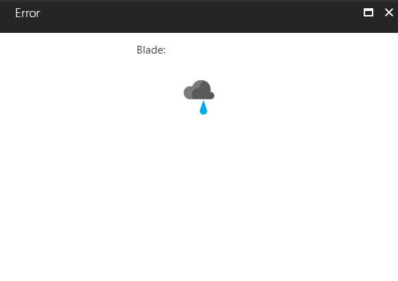

<a name="parts"></a>
# Parts
   
<a name="parts-overview"></a>
## Overview

Parts, also known as tiles, are a framework feature that integrates the UI of an extension on dashboards.  Parts were more prevalent on blades, but this older pattern is being obsoleted by TemplateBlades that do not contain parts. For more information about template blades, see [portalfx-blades-overview.md](portalfx-blades-overview.md).

Intrinsic parts are composed of existing controls in the portal, and provide patterns for solving common patterns in the portal.

Many of the intrinsics can be found in the playground located at [https://aka.ms/portalfx/playground](https://aka.ms/portalfx/playground).

The remainder of them can be located in the working copy located at  [https://aka.ms/portalfx/samples/#blade/SamplesExtension/IntrinsicPartsIndexBlade](https://aka.ms/portalfx/samples/#blade/SamplesExtension/IntrinsicPartsIndexBlade).

The following sections cover these topics.

* [Traditional Blades versus Template Blades](#traditional-parts-and-template-blades)

* [Displaying data by using intrinsic parts](#displaying-data-by-using-intrinsic-parts)

* [Custom parts](#custom-parts)

* [Integrating parts into the part gallery](#integrating-parts-into-the-part-gallery)

* [Defining the sizing behavior](#defining-the-sizing-behavior)

* [Per user part settings](#per-user-part-settings)

* [The 'no data' message](#the-"no-data"-message)

* [Pinning parts](#pinning-parts)

* * * 

<a name="parts-overview-traditional-parts-and-template-blades"></a>
### Traditional parts and template blades

Previously, Ibiza blades contained customizable parts, or tiles, that served as the main way for users to navigate the UI. However, the UI's were difficult to navigate, caused excessive navigation, caused excessive horizontal scrolling, and were not very performant.

Newer UI experiences combine traditional menu blades with TemplateBlades to display features and content.

There are still many cases where extensions may display rich monitoring experiences or at-a-glance data. To support those cases, Ibiza now supports multiple, shareable dashboards that were once known as the single start board.

It is highly recommended that developers who still need to build parts should build them for use on dashboards, instead of blades.

<a name="parts-overview-displaying-data-by-using-intrinsic-parts"></a>
### Displaying data by using intrinsic parts

Built-in parts, also known as intrinsic parts, let extension developers create parts that contain pre-defined views and interaction patterns, but lets them plug in their own data.

**NOTE**: In this discussion, `<dir>` is the `SamplesExtension\Extension\` directory, and  `<dirParent>`  is the `SamplesExtension\` directory, based on where the samples were installed when the developer set up the SDK. If there is a working copy of the sample in the Dogfood environment, it is also included.

The following example of a Button part contains an icon and a label that navigates to a blade when the user clicks it. The three files used for the button part example are the following.

*  `<dir>\Client\V1\Parts\Intrinsic\ButtonPart\ViewModels\ButtonPartIntrinsicInstructionsPartViewModel.ts`

* `<dir>\Client\V1\Parts\Intrinsic\ButtonPart\ButtonPartIntrinsicInstructions.pdl`

* `<dir>\Client\V1\Parts\Intrinsic\ViewModels\ButtonPartViewModel.ts`

A working copy of the sample is located at [http://aka.ms/portalfx/samples#blade/SamplesExtension/ButtonPartIntrinsicInstructions/selectedItem/ButtonPartIntrinsicInstructions/selectedValue/ButtonPartIntrinsicInstructions](http://aka.ms/portalfx/samples#blade/SamplesExtension/ButtonPartIntrinsicInstructions/selectedItem/ButtonPartIntrinsicInstructions/selectedValue/ButtonPartIntrinsicInstructions).

The following procedure demonstrates how to use a button part.

1. Declare the part in the global `<Definition>` section of the PDL for the extension, as in the following example.

  ```xml

<!-- Name - Give your part a unique name -->
<!-- PartKind - This is where you declare that you're using a built in part type -->
<!-- ViewModel A pointer to the view model type that will customize the view (label, icon, etc) -->
<!-- InitialSize - The initial size of the part, in this case 2 X 1 (Small) -->
<Part Name="ButtonPartSmall" 
      PartKind="Button"
      ViewModel="{ViewModel Name=ButtonPartViewModel, Module=./Intrinsic/ViewModels/ButtonPartViewModel}"
      InitialSize="Small" />

```

1. The ViewModel that is associated with the pdl will plug data into the part. The ViewModel is located at `<dir>\Client\V1\Parts\Intrinsic\ViewModels\ButtonPartViewModel.ts`  For this step, the data is just the label and icon, but for more data-oriented parts, the data can be gathered from a server, like a resource provider. The ViewModel is in the following code.

 ```typescript

/**
* This sample uses the base class implementation. You can also implement the
* interface MsPortalFx.ViewModels.ButtonPartContract.
*/
export class ButtonPartViewModel extends MsPortalFx.ViewModels.ButtonPart {

   /**
    * Initialize the part.
    */
   constructor(container: MsPortalFx.ViewModels.PartContainerContract, initialState: any, dataContext: DataContext) {
       super();
       this.title(ClientResources.AssetTypeNames.Robot.singular);
       this.shortTitle(ClientResources.AssetTypeNames.Robot.singular);
       this.description(ClientResources.robotDescription);
       this.icon(CommonImages.robot);

       container.assetName(ClientResources.robotManufacturerBotsAreUs);
   }
}

```

<a name="parts-overview-custom-parts"></a>
### Custom parts

Unlike intrinsic parts, custom parts use `html` templates that are bound to the view model. The developer defines the look and feel in addition to the data loading for the part. Templates also can use other controls that are provided by the framework, as specified in [top-extensions-controls.md](top-extensions-controls.md).

The following is an example of a custom part. The three files used for the custom part example are the following.

* `<dir>\Client\V1\Parts\Custom\CustomParts.pdl`

* `<dir>\Client\V1\Parts\Custom\Templates\ExampleCustomPart.html`

* `<dir>\Client\V1\Parts\Custom\ViewModels\ExampleCustomPartViewModel.ts`

A working copy is located at [http://aka.ms/portalfx/samples#blade/SamplesExtension/SDKMenuBlade/custompart](http://aka.ms/portalfx/samples#blade/SamplesExtension/SDKMenuBlade/custompart).

The following procedure demonstrates how to use a custom part.

1. Declare the part in the global `<Definition>` section of the PDL for the extension, as in the following example.

   ```xml

<CustomPart Name="ExampleCustomPart"
            ViewModel="{ViewModel Name=ExampleCustomPartViewModel, Module=./Custom/ViewModels/ExampleCustomPartViewModel}"
            Template="{Html Source='Templates\\ExampleCustomPart.html'}"
            InitialSize="Large">
  <StyleSheet Source="{Css Source='Styles\\ExampleStyles.css'}" />
</CustomPart>

```

1. The pdl points to the html template.

  ```xml

<h3>This is a custom part</h3>

<p>
Number of clicks: <strong data-bind="text: numberOfClicks"></strong>
</p>

<div data-bind="visible: allowMoreClicks">
<button data-bind="click: increaseClickCount">Click me</button>
</div>

<div class="ext-too-many-clicks-box" data-bind="visible: !allowMoreClicks()">
That's too many clicks!
<button data-bind="click: resetClickCount">Reset</button>
</div>

<ul data-bind="foreach: myButtons">
<li>    
    <button data-bind="text: displayName, click: $parent.buttonClickHandler"></button>
    Number of clicks: <strong data-bind="text: clicked"></strong>
</li>
</ul>

```

1. The HTML template is bound to the following ViewModel by using **Knockout**, which is also referred to in the pdl.

  ```typescript

/**
* Example view model for a custom part
*/
export class ExampleCustomPartViewModel {

   // Public properties bound to the UI in the part's template
   public numberOfClicks = ko.observable(0);
   public allowMoreClicks = ko.pureComputed(() => {
       return this.numberOfClicks() < 3;
   });

   /**
    * Constructs an instance of the custom part view model.
    */
   constructor(container: MsPortalFx.ViewModels.PartContainerContract, initialState: any, dataContext: PartsArea.DataContext) {
   }

   public increaseClickCount(): void {
       var currentCount = this.numberOfClicks();
       this.numberOfClicks(currentCount + 1);
   }

   public resetClickCount(): void {
       this.numberOfClicks(0);
   }

   public myButtons = ko.observableArray([
       {
           displayName: ko.observable("First button"),
           clicked: ko.observable(0)
       },
       {
           displayName: ko.observable("Second button"),
           clicked: ko.observable(0)
       }
   ]);

   public buttonClickHandler = () => {
       this.numberOfClicks(this.numberOfClicks() + 1);
   };
}

```

### Integrating parts into the part gallery

Tiles are added to dashboards by using the part gallery, which is also known as the tile gallery.  The tile gallery is displayed  when the **Edit Dashboard** command is clicked, or when parts on the dashboard are rearranged or resized.

To register a part with the gallery, you need to add the `PartGalleryInfo` tag inside the `<Part>` or `<CustomPart>` tag, as in the file located at `<dir>\Client/V1/Parts/TileGallery/TileGallery.pdl` and in the following code.

   ```xml

<PartGalleryInfo
  Title="{Resource generalGalleryPartTitle, Module=ClientResources}"
  Category="{Resource partGalleryCategorySample, Module=ClientResources}"
  Thumbnail="MsPortalFx.Base.Images.Favorite()"
  AutoConfigSelectablePath="configOnDropSelectable"/>

```

The **Title**, **Category**, and **Thumbnail** parts are reasonably intuitive.

Some tile experiences require that parts are configured when they are dropped from the tile gallery. The **AutoConfigSelectablePath** property performs this task for parts that have this requirement.
 
  <!-- TODO: Determine whether the following sentence is more appropriate.
   The **AutoConfigSelectablePath** property set a requirement to configure parts when they are dropped from the tile gallery.
   for parts that have this requirement.
  -->
 
 The following is the path to a selectable that is located inside the ViewMmodel and is immediately set to `true` by the Framework when the part is dropped on a dashboard. The selectable can be configured to open a context blade for configuration. The  example located at `<dir>/Client/V1/Parts/TileGallery/ViewModels/GeneralGalleryPart.ts` demonstrates how this type of selectable is configured. The example code is in the following code. 

   ```typescript

// Configure the HotSpot's Selectable so it will be implicitly activated when the user drops this Part on a Dashboard.
const bladeSelection: FxViewModels.DynamicBladeSelection = {
    detailBlade: ExtensionDefinition.BladeNames.pdlGeneralGalleryPartConfigurationBlade,
    detailBladeInputs: {}
};
const hotSpotSelectable = new FxViewModels.Selectable({
    selectedValue: bladeSelection
});
hotSpotSelectable.getDefaultSelection = () => {
    return Q(bladeSelection);
};
this.configureHotSpot.selectable = hotSpotSelectable;
this.configOnDropSelectable = hotSpotSelectable;
    
// Create a ParameterCollector that will open the configure Blade to modify 'configuration' -- this Part's Configuration.
const configuration = container.activateConfiguration<Inputs, Def.SettingsContract>();
const collector = new FxViewModels.ParameterCollector<PartConfiguration>(container, {
    selectable: hotSpotSelectable,

    // The Parts Configuration values are sent to the Provider Blade to be edited by the user.
    supplyInitialData: configuration.getValues.bind(configuration),

    // The edited Configuration values are returned from the Provider Blade and updated in this Part.
    // Any edits will cause 'onInputsSet' to be called again, since this is the method where the Part receives a new, consistent
    // set of inputs/settings.
    receiveResult: configuration.updateValues.bind(configuration)
});

// This Selectable must be dynamically registered due to a PDL compiler bug that rejects any <BladeAction> that opens a
// <ContextBlade> from a HotSpot.
container.registerSelectable(
    container,
    "GeneralGalleryPartConfigSelectable",
    hotSpotSelectable,
    {
        openInContextPane: true,
        parameterCollector: collector
    });
  
```

If the part that is being developed is associated with an Ibiza asset like an ARM resource, then it should be associated with an asset type and have a single input definition whose `IsAssetId` property is `true`.  If this is not the case then the part will appear in the **General** category of the part gallery.
 
### Defining the sizing behavior

There is a significant amount of flexibility when sizing extension tiles. All size options are included in the `<CustomPart>` tag in the PDL file located at `<dir>\Client/V1/Parts/PartSizes/PartSizes.pdl`.

A working copy is located at [http://aka.ms/portalfx/samples#blade/SamplesExtension/SDKMenuBlade/partsizes](http://aka.ms/portalfx/samples#blade/SamplesExtension/SDKMenuBlade/partsizes).

1. The following part supports only the large, standard size.

    <!-- determine why this section stops the gitHub build.-->

    ```xml

<CustomPart Name="LargePart"
            ViewModel="{ViewModel Name=PartSizesLargePartViewModel, Module=./PartSizes/ViewModels/PartSizesViewModels}"
            Template="{Html Source='Templates\\SizeAwarePart.html'}"
            InitialSize="Large">

```

1. The following part supports multiple, standard sizes.

    <!-- determine why this section stops the gitHub build.-->

    ```xml

<CustomPart Name="MiniPart"
            ViewModel="{ViewModel Name=PartSizesMiniPartViewModel, Module=./PartSizes/ViewModels/PartSizesViewModels}"
            Template="{Html Source='Templates\\SizeAwarePart.html'}"
            InitialSize="Mini">
  <CustomPart.SupportedSizes>
    <PartSize>Mini</PartSize>
    <PartSize>Normal</PartSize>
  </CustomPart.SupportedSizes>
</CustomPart>

```

1. The following part defaults to an arbitrary size, and can be resized by the user.  The Framework automatically adds a drag handle to this part because of the value `ResizeMode="User"`.

    ```xml

<CustomPart Name="CustomSizeUserResizePart"
            ViewModel="{ViewModel Name=PartSizesCustomSizeUserResizePartViewModel, Module=./PartSizes/ViewModels/PartSizesViewModels}"
            Template="{Html Source='Templates\\SizeAwarePart.html'}"
            InitialSize="Custom"
            InitialWidth="5"
            InitialHeight="2"
            ResizeMode="User">
</CustomPart>

```

1. The following part defaults to an arbitrary size, and can be resized programatically.  

     ```xml

<CustomPart Name="CustomSizeProgrammaticResizePart"
            ViewModel="{ViewModel Name=PartSizesCustomSizeProgrammaticResizePartViewModel, Module=./PartSizes/ViewModels/PartSizesViewModels}"
            Template="{Html Source='Templates\\SizeAwareResizablePart.html'}"
            InitialSize="Custom"
            InitialWidth="6"
            InitialHeight="3"
            ResizeMode="Programmatic">
  <CustomPart.SupportedSizes>
    <PartSize>Tall</PartSize>
    <PartSize>Mini</PartSize>
    <PartSize>Wide</PartSize>
    <PartSize>Large</PartSize>
  </CustomPart.SupportedSizes>
</CustomPart>

```

1. The following code demonstrates  how to programatically resize the part from within the associated ViewModel.  The parameters are specified in grid units instead of pixels. The code is located at `<dir>\Client\V1\Parts\PartSizes\ViewModels\PartSizesViewModels.ts`.


      ```typescript

onClick: () => {
    container.resizeTo(resizeA.width, resizeA.height)
}
        });

        
```

<a name="parts-overview-per-user-part-settings"></a>
### Per user part settings

Extensions can read and write settings that are saved whenever the user saves a dashboard.  Private dashboards are located in the Ibiza user settings service.  Shared dashboards are stored in ARM as Azure resources inside the **MS.Portal** resource provider.

The dashboard is saved as a `JSON` document that contains the list of parts on the dashboard, in addition to their sizes, positions, and settings.  It also contains dashboard-level settings like the time range that is shared by many monitoring charts.

The following example located at `<dir>/Client/V1/Parts/TileGallery/TileGallery.pdl` demonstrates the use of the `<CustomPart.PartSettings>` tag to declare settings in the PDL file. It is also in the following code.

   ```xml

<CustomPart.Settings>
  <Setting Property="colorSettingValue" />
  <Setting Property="fontSettingValue" />
</CustomPart.Settings>

```

The following is the TypeScript code that reads and writes settings. It is also located at `<dir>Client/V1/Parts/TileGallery/ViewModels/GeneralGalleryPart.ts`.

   ```typescript

import ClientResources = require("ClientResources");
import PartsArea = require("../../PartsArea");
import ExtensionDefinition = require("../../../../_generated/ExtensionDefinition");
import Def = ExtensionDefinition.ViewModels.V1$Parts.GeneralGalleryPart;

export = Main;

module Main {
"use strict";

import FxViewModels = MsPortalFx.ViewModels;
import PartContainerContract = FxViewModels.PartContainerContract;
import FxConfiguration = MsPortalFx.Composition.Configuration;
import TimeUnit = FxConfiguration.TimeUnit;

// We have to explicitly define our Inputs contract here rather than use Def.InputsContract since there is a PDL
// compiler bug where <Part.InputDefinitions> are not represented on Def.InputsContract.
export interface Inputs {
    timeRange: FxConfiguration.TimeRange,
    otherParameter: string
};

// We have to use this over Def.Settings because Def.Settings includes an old 'content' property that is no longer
// important to the Part Configuration design re: Part Settings.
export type Settings = Def.Settings$content$0;

// This will be used by the GeneralGalleryPartConfigurationPart too.
export type PartConfiguration = FxConfiguration.Part.ValuesWithMetadata<Inputs, Settings>;

export enum BackgroundColor {
    Default,
    Blue,
    Green,
    Yellow
}

export enum FontStyle {
    Default,
    Muted,
    AllCaps,
}

export class GeneralGalleryPart implements Def.Contract {
    public configOnDropSelectable: FxViewModels.Selectable<FxViewModels.DynamicBladeSelection>;
    public configureHotSpot: FxViewModels.Controls.HotSpot.ViewModel;

    public timeRange = ko.observable<string>();
    public otherParameter = ko.observable<string>();
    public css: KnockoutObservableBase<any>;  // For the 'css' binding in the corresponding HTML template.
    public location: string;

    // These are required by the portal presently.  Re: Part Settings, the Part below works exclusively in terms of
    // 'configuration.updateValues' to update settings values and 'onInputsSet(..., settings)' to receive settings values.
    public colorSettingValue = ko.observable<BackgroundColor>();
    public fontSettingValue = ko.observable<FontStyle>();

    // These store the raw color and font style values supplied to the Part.
    private _colorSetting = ko.observable<BackgroundColor>();
    private _fontSetting = ko.observable<FontStyle>();

    constructor(container: PartContainerContract, initialState: any, context: PartsArea.DataContext) {

        container.partTitle(ClientResources.generalGalleryPartTitle);

        // Create the HotSpot control that the user will click.
        this.configureHotSpot = new FxViewModels.Controls.HotSpot.ViewModel(container);
        this.configureHotSpot.clickableDuringCustomize = true;
        //parts#PartGalleryConfigOnDropDoc
        // Configure the HotSpot's Selectable so it will be implicitly activated when the user drops this Part on a Dashboard.
        const bladeSelection: FxViewModels.DynamicBladeSelection = {
            detailBlade: ExtensionDefinition.BladeNames.pdlGeneralGalleryPartConfigurationBlade,
            detailBladeInputs: {}
        };
        const hotSpotSelectable = new FxViewModels.Selectable({
            selectedValue: bladeSelection
        });
        hotSpotSelectable.getDefaultSelection = () => {
            return Q(bladeSelection);
        };
        this.configureHotSpot.selectable = hotSpotSelectable;
        this.configOnDropSelectable = hotSpotSelectable;
            
        // Create a ParameterCollector that will open the configure Blade to modify 'configuration' -- this Part's Configuration.
        const configuration = container.activateConfiguration<Inputs, Def.SettingsContract>();
        const collector = new FxViewModels.ParameterCollector<PartConfiguration>(container, {
            selectable: hotSpotSelectable,

            // The Parts Configuration values are sent to the Provider Blade to be edited by the user.
            supplyInitialData: configuration.getValues.bind(configuration),

            // The edited Configuration values are returned from the Provider Blade and updated in this Part.
            // Any edits will cause 'onInputsSet' to be called again, since this is the method where the Part receives a new, consistent
            // set of inputs/settings.
            receiveResult: configuration.updateValues.bind(configuration)
        });

        // This Selectable must be dynamically registered due to a PDL compiler bug that rejects any <BladeAction> that opens a
        // <ContextBlade> from a HotSpot.
        container.registerSelectable(
            container,
            "GeneralGalleryPartConfigSelectable",
            hotSpotSelectable,
            {
                openInContextPane: true,
                parameterCollector: collector
            });
          //parts#PartGalleryConfigOnDropDoc
        // For fringe cases, this illustrates how the Part can understand whether it is located on a Dashboard or a Blade.
        // Importantly, the Part behavior shouldn't change between Dashboard and Blade.
        this.location = container.location === FxViewModels.PartLocation.Dashboard ?
            ClientResources.generalGalleryPartDashboardLocation :
            ClientResources.generalGalleryPartBladeLocation;

        // Data-driven styling for the Part.
        this.css = ko.computed(container, () => {
            const colorSetting = this._colorSetting();
            const fontSetting = this._fontSetting();
            return {
                "msportalfx-bgcolor-h2": colorSetting === BackgroundColor.Blue,
                "msportalfx-bgcolor-i2": colorSetting === BackgroundColor.Green,
                "msportalfx-bgcolor-j2": colorSetting === BackgroundColor.Yellow,
                "msportalfx-text-muted-50": fontSetting === FontStyle.Muted,
                "msportalfx-text-header-small": fontSetting === FontStyle.AllCaps,
            };
        });
    }

    public onInputsSet(inputs: Inputs, settings: Def.SettingsContract): MsPortalFx.Base.Promise {

        // Any changes to the Part's Configuration values (see 'updateValues' above) will cause 'onInputsSet' to be called with the
        // new inputs/settings values.
        this.timeRange(inputs.timeRange ? timeRangeToString(inputs.timeRange) : ClientResources.generalGalleryPartNone);
        this.otherParameter(inputs.otherParameter || ClientResources.generalGalleryPartNone);
        this._colorSetting(settings && settings.content && settings.content.colorSettingValue || BackgroundColor.Default);
        this._fontSetting(settings && settings.content && settings.content.fontSettingValue || FontStyle.Default);

        return null;
    }
}

function timeRangeToString(timeRange: FxConfiguration.TimeRange): string {
    if (timeRange.relative) {
        const duration = timeRange.relative.duration;
        const plural = duration > 1;
        let timeUnit: string;
        switch (timeRange.relative.timeUnit) {
            case TimeUnit.Minute:
                timeUnit = plural ? ClientResources.timeUnitMinutes : ClientResources.timeUnitMinute;
                break;
            case TimeUnit.Hour:
                timeUnit = plural ? ClientResources.timeUnitHours : ClientResources.timeUnitHour;
                break;
            case TimeUnit.Day:
                timeUnit = plural ? ClientResources.timeUnitDays : ClientResources.timeUnitDay;
                break;
            case TimeUnit.Week:
                timeUnit = plural ? ClientResources.timeUnitWeeks : ClientResources.timeUnitWeek;
                break;
            case TimeUnit.Month:
                timeUnit = plural ? ClientResources.timeUnitMonths : ClientResources.timeUnitMonth;
                break;
            case TimeUnit.Year:
                timeUnit = plural ? ClientResources.timeUnitYears : ClientResources.timeUnitYear;
                break;
        }
        return "{0} {1} {2}".format(ClientResources.timeRangeLast, duration, timeUnit);
    } else {
        return "{0} - {1}".format(timeRange.absolute.from, timeRange.absolute.to);
    }
}
}

```

<a name="parts-overview-the-no-data-message"></a>
### The &quot;no data&quot; message

Sometimes parts are displayed for which no data is available. For example, an extension may display a prototype 'deployment history' that contains sample data, previous to the time when the user  enables  deployments for the extension. To support this, part `container` objects use the `noDataMessage` property.

The following example populates the part with sample data and set `noDataMessage` to a non-empty string.

```ts
container.noDataMessage("Enable deployments to see your history");
```

In this example, the part is grayed-out and is non-interactive. The message is displayed on top of the part. To remove the message, set the `noDataMessage` value back to `null`. 

This feature informs the user that the feature exists, although no data is available yet. If the extension needs to disable a part while the  data is loading, it should return a promise from the  `onInputsSet` method or use the `container.operations` queue.

<a name="parts-overview-pinning-parts"></a>
### Pinning parts

By default, all blades and parts are 'pinnable'.  Pinning a part creates a copy of that part on the [dashboard](portalfx-ui-concepts.md#ui-concepts-the-dashboard).  The part on the dashboard provides a shortcut for users, allowing them to get their most used blades, as in the following example.


All parts are pinnable by default, at little or no cost to the developer.  Part settings are copied to the new part, and the current size is maintained.  The new part is a complete copy of the original part, and can be independently configured, resized, or moved around on the dashboard. 

When a part is pinned or moved to another blade, a new ViewModel for that part is created.  This ViewModel will have the exact same contract.  The inputs to the part are stored in the Portal's cloud settings, and replayed onto the part when the dashboard loads.  For example, the robots part in this sample takes a single input named `id`, which comes from the blade.  When the part is pinned to the dashboard, the blade will obviously not be available, therefore the `id` of the part is stored in persistent storage. The  `id` of the part is in the pdl file located at `<dir>\SamplesExtension\Extension\Client\Hubs\Browse\Browse.pdl`, and it is also in the following code.

```xml
<CustomPart Name="RobotSummary"
            ViewModel="{ViewModel Name=RobotSummaryViewModel, Module=./Browse/ViewModels/RobotSummaryViewModel}"
            Template="{Html Source='Templates\\Robot.html'}"
            InitialSize="FullWidthFitHeight"
            AssetType="Robot"
            AssetIdProperty="name">
  <CustomPart.Properties>
    <Property Name="name"
              Source="{BladeParameter Name=id}" />
  </CustomPart.Properties>
</CustomPart>
```

Model data is not sent in bindings because the extension is required to store specific types of data in persistent storage. The only objects that should be sent as bindings between the extension and the various parts are the keys and ids that are used to load data from a back end server.   If data that specifies the robot changes, like  the name, those changes should be reflected in the part.  This provides the 'live tile' feel of the Portal, and ensures that the part data is not stale.

For more information about keys and data loading in the Portal, see [top-legacy-data.md](top-legacy-data.md).

<a name="parts-overview-preventing-pinning"></a>
### Preventing pinning

In some cases, a part should not be pinnable.  Some instances are as follows.

* The part is showing an editable form
* The part is not performant enough to run persistently
* The part should not be displayed in a constrained UX
* The part has no value when pinned

Parts are not individually flagged as not being pinnable.  Rather, a blade that contains those parts is `locked`, as in the sample located at `<dir>\SamplesExtension\Extension\Client\extension.pdl` and in the following code.

```xml
<Blade Name="SamplesBlade"
       ViewModel="SamplesBladeViewModel"
       Pinnable="True"
       Locked="True">
```

**NOTE**:  All parts in the previous `SamplesBlade` will not provide the ability to be pinned.  However, the blade itself can still be pinned, as specified in [portalfx-blades-pinning.md](portalfx-blades-pinning.md).

For more information, about sharing parts, see [portalfx-extensibility-pde.md](portalfx-extensibility-pde.md).


<a name="parts-versioning"></a>
## Versioning

When users customize or pin a part, the following states are stored and used the next time the part is loaded from a customized context.

1. Basic part metadata, like part name or extension name
1. Part inputs, like resource id
1. Part settings, like time range for a chart

Because these states are stored, these parts need to be backwards-compatible.

Supporting new functionality may require the modification of the schema of a part's inputs and settings. 

The Azure Portal always calls the most recent edition of an extension, which is specified in the extensions configuration file. However, older versions of inputs and settings that were stored by earlier editions of an extension may still exist, and they may be incompatible with the most recent edition of the extension. Consequently, users may experience unexpected results when the extension or part is called with previous settings.

Likewise, other extensions may have taken dependencies on less-recent editions of the extension or part. For example, another extension may use a .pde file that contains a `<PartReference/>`.  Those other extensions may also experience unexpected results when they call the extension or part with previous inputs.

**NOTE**: In this discussion, `<dir>` is the `SamplesExtension\Extension\` directory, and  `<dirParent>`  is the `SamplesExtension\` directory, based on where the samples were installed when the developer set up the SDK. If there is a working copy of the sample in the Dogfood environment, it is also included.

This example is based on the sample located at `<dir>\Client\V1\Hubs\Browse\Browse.pdl`. It builds on the ViewModel located at `<dir>\Client\V1\Hubs\Browse\ViewModels\RobotPartViewmodel.ts`.

 The **CanUseOldInputVersion** attribute can be set to `true` to specify that the part can process older versions of inputs. It should be used in conjunction with the  part property named `version`, as in the following example.

<!-- TODO:  Determine whether the following sample is causing GitHub to stop the build. -->
    <?xml version="1.0" encoding="utf-8" ?>
<Definition xmlns="http://schemas.microsoft.com/aux/2013/pdl"
            Area="V1/Hubs"
            ModulePath="./Browse/ViewModels">

  <!--
    The following example shows you how to integrate with browse.  Browse and notifications
    require defining an AssetType for the given resource:
  -->

  <AssetType Name="Robot"
             SingularDisplayName="{Resource AssetTypeNames.Robot.singular, Module=ClientResources}"
             PluralDisplayName="{Resource AssetTypeNames.Robot.plural, Module=ClientResources}"
             LowerSingularDisplayName="{Resource AssetTypeNames.Robot.lowerSingular, Module=ClientResources}"
             LowerPluralDisplayName="{Resource AssetTypeNames.Robot.lowerPlural, Module=ClientResources}"
             Icon="{Resource CommonImages.robot, Module=V1/ResourceTypes/Common/CommonLogos}"
             BladeName="RobotBlade"
             PartName="RobotPart">
    <Browse ServiceViewModel="{ViewModel Name=RobotBrowseService, Module=./Browse/Services/RobotBrowseService}" />
    <GridColumns ServiceViewModel="{ViewModel Name=RobotGridColumnsService, Module=./Browse/Services/RobotGridColumnsService}" />
  </AssetType>

    <!--
    The command group provides a way to group common command which can execute
    against a blade, part, or asset type

    This command group is used by the robot in the browse grid, so the source for the ID property
    is the asset expansion property "$MSPORTALFX$assetDetails$assetId".
  -->
  <CommandGroup Name="RobotCommands">
    <Command Name="RobotMaintenanceCommand"
             Text="{Resource sendToMaintenanceCommand, Module=ClientResources}"
             ViewModel="SendToMaintenanceCommandViewModel"
             AssetType="Robot"
             AssetIdProperty="id">
      <Property Name="id"
                Source="{DataInput Property=$MSPORTALFX$assetDetails$assetId}" />
    </Command>
    <Command Name="RobotHistoryCommand"
             Kind="Blade"
             Text="{Resource maintenanceHistory, Module=ClientResources}"
             ViewModel="MaintenanceHistoryCommandViewModel"
             AssetType="Robot"
             AssetIdProperty="id">
      <Property Name="id"
                Source="{DataInput Property=$MSPORTALFX$assetDetails$assetId}" />
      <BladeAction Blade="RobotMaintenanceHistory">
        <BladeInput Parameter="id"
                    Source="id" />
      </BladeAction>
    </Command>
    <Command Name="CloneRobotCommand"
             Text="{Resource cloneRobotCommand, Module=ClientResources}"
             ViewModel="CloneRobotCommandViewModel"
             AssetType="Robot"
             AssetIdProperty="id">
      <Property Name="id"
                Source="{DataInput Property=$MSPORTALFX$assetDetails$assetId}" />
    </Command>
    <Command Name="DeleteRobotCommand"
             Text="{Resource deleteRobotCommand, Module=ClientResources}"
             ViewModel="DeleteRobotCommandViewModel"
             AssetType="Robot"
             AssetIdProperty="id">
      <Property Name="id"
                Source="{DataInput Property=$MSPORTALFX$assetDetails$assetId}" />
    </Command>
  </CommandGroup>

  <!--
    This part represents an overview of a robot, and is available to be used
    on the startboard, or inside of a blade.  You refer to this part in the AssetType
    declaration above, so it can be used by notifications and browse.
  -->
  <Part Name="RobotPart"
        ViewModel="RobotPartViewModel"
        CanUseOldInputVersions="true"
        PartKind="Button"
        AssetType="Robot"
        AssetIdProperty="name">
    <Part.Properties>
      <Property Name="version"
                Source="{Constant 2}" />
      <Property Name="name"
                Source="{DataInput Property=id}" />
    </Part.Properties>
    <BladeAction Blade="RobotBlade">
      <!--
        Currently, parts which accept inputs from notifications and browse require
        the input property to the part or blade be named 'id'.
      -->
      <BladeInput
          Source="name"
          Parameter="id" />
    </BladeAction>

    <!--
      Associate the commands with the part.

      Here we re-bind the "id" property to the part's "name" property instead of the asset expansion property.
      This rewires the binding for this instance of the command.
    -->
    <CommandGroupReference Name="RobotCommands">
      <CommandBindings Command="RobotMaintenanceCommand">
        <Binding Property="id"
                 Source="{DataInput Property=id}" />
      </CommandBindings>
      <CommandBindings Command="RobotHistoryCommand">
        <Binding Property="id"
                 Source="{DataInput Property=id}" />
      </CommandBindings>
      <CommandBindings Command="CloneRobotCommand">
        <Binding Property="id"
                 Source="{DataInput Property=id}" />
      </CommandBindings>
      <CommandBindings Command="DeleteRobotCommand">
        <Binding Property="id"
                 Source="{DataInput Property=id}" />
      </CommandBindings>
    </CommandGroupReference>
  </Part>

  <!--
    The following blade represents the details view for a robot.
  -->
    <!-- portalfx-blades-properties#property-element -->
  <Blade Name="RobotBlade"
         ViewModel="RobotBladeViewModel"
         AssetType="Robot"
         AssetIdProperty="name">
    <Blade.Parameters>
      <Parameter Name="id"
                 Type="Key"/>
    </Blade.Parameters>

    <Blade.Properties>
      <!--
        Results from a browse or notification always pass a property named 'id' into the blade
      -->
      <Property Name="name"
                Source="{BladeParameter Name=id}"/>
    </Blade.Properties>
    <!-- portalfx-blades-properties#property-element -->
    <!--
      Specify which part should be pinned to the startboard when a user pins the blade
    -->
    <PinnedPart PartType="RobotPart" />

    <!--
      Associate the commands with the blade.

      Here we re-bind the "id" property to the blade's "ID" parameter instead of the asset expansion property.
      This rewires the binding for this instance of the command.
    -->
    <CommandGroupReference Name="RobotCommands">
      <CommandBindings Command="RobotMaintenanceCommand">
        <Binding Property="id"
                 Source="{DataInput Property=id}" />
      </CommandBindings>
      <CommandBindings Command="RobotHistoryCommand">
        <Binding Property="id"
                 Source="{DataInput Property=id}" />
      </CommandBindings>
      <CommandBindings Command="CloneRobotCommand">
        <Binding Property="id"
                 Source="{DataInput Property=id}" />
      </CommandBindings>
      <CommandBindings Command="DeleteRobotCommand">
        <Binding Property="id"
                 Source="{DataInput Property=id}" />
      </CommandBindings>
    </CommandGroupReference>

    <Lens Name="RobotBladeLens">

      <!--
        This part expects a property binding from the blade named "id", which is
        passed as an input from a grid, a notification, or a browse result.
      -->
      <CustomPart Name="RobotSummary"
                  ViewModel="RobotSummaryViewModel"
                  Template="{Html Source='Templates\\Robot.html'}"
                  InitialSize="FullWidthFitHeight"
                  AssetType="Robot"
                  AssetIdProperty="name">
        <CustomPart.Properties>
          <Property Name="name"
                    Source="{BladeParameter Name=id}" />
        </CustomPart.Properties>
      </CustomPart>

    </Lens>

    <Lens Name="RobotAssetTypeApiLens">

      <!--
        This part expects a property binding from the blade named "id", which is
        passed as an input from a grid, a notification, or a browse result.
        This part demonstrates how an extension can ask the shell for asset type
        information for an asset type.
      -->
      <CustomPart Name="RobotAssetTypeApiPart"
                  ViewModel="RobotAssetTypeApiPartViewModel"
                  Template="{Html Source='Templates\\RobotAssetTypeApi.html'}"
                  InitialSize="FullWidthFitHeight"
                  AssetType="Robot"
                  AssetIdProperty="name">
        <CustomPart.Properties>
          <Property Name="name"
                    Source="{BladeParameter Name=id}" />
        </CustomPart.Properties>
      </CustomPart>

    </Lens>

    <Lens Name="RobertConfigLens" Title="{Resource generalGalleryPartTitle, Module=ClientResources}">
      <PartReference Name="RobertGeneralGalleryPart" PartType="GeneralGalleryPart" />
      <PartReference Name="RobertGeneralGalleryPdlPart" PartType="PdlGeneralGalleryPart" />
    </Lens>

    <Lens Name="RobertAdaptedConfigLens" Title="{Resource adaptedGalleryPartTitle, Module=ClientResources}">
      <PartReference Name="RoberAdaptedGalleryPart" PartType="AdaptedGalleryPart" />
      <PartReference Name="RoberAdaptedGalleryPdlPart" PartType="PdlAdaptedGalleryPart" />
    </Lens>

  </Blade>

  <Blade Name="RobotMaintenanceHistory"
         ViewModel="RobotMaintenanceHistoryBladeViewModel">
    <Blade.Parameters>
      <Parameter Name="id"
                 Type="Key" />
    </Blade.Parameters>
    <Blade.Properties>
      <Property Name="id"
                Source="{BladeParameter id}" />
    </Blade.Properties>
  </Blade>

</Definition>


```xml
<Part Name="RobotPart"
      ViewModel="{ViewModel Name=RobotPartViewModel, Module=./Browse/ViewModels/RobotPartViewModel}"
      CanUseOldInputVersions="true"
      PartKind="Button"
      AssetType="Robot"
      AssetIdProperty="name">
    <Part.Properties>
        <Property Name="version"
                  Source="{Constant 2}" />
        <Property Name="name"
                  Source="{DataInput Property=id}" />
    </Part.Properties>
</Part>
```

**NOTE**: Inline parts can specify the current version as a constant.  Although this is the first explicit version, we recommend using  a value of `2` the first time it is used.

Globally-defined parts can not specify constant bindings, but the flow is mostly the same.

```xml
<CustomPart Name="RobotSummary2"
            Export="true"
            ViewModel="RobotSummaryViewModel"
            CanUseOldInputVersions="true"
            Template="{Html Source='Templates\\Robot.html'}"
            InitialSize="FullWidthFitHeight">
    <CustomPart.Properties>
        <Property Name="name"
                  Source="{DataInput Property=name}" />
        <Property Name="version"
                  Source="{DataInput Property=version}" /> <!-- currently 2 -->
    </CustomPart.Properties>
</CustomPart>
```

  The following code demonstrates how to process explicitly-versioned inputs, in addition to the version of the parts that existed previous to the addition of explicit versioning support.

```javascript
public onInputsSet(inputs: Def.InputsContract, settings: Def.SettingsContract): MsPortalFx.Base.Promise {
        var name: string;
        if (inputs.version === "2") {  // this block explicitly handles version 2, which is the latest
            name = inputs.name;
        } else if (inputs.version === "1") { // this block explicitly handles version 1, which is now old, but was an explicit version
            var oldInputs: any = inputs;
             name = oldInputs.oldName;
        } else if (MsPortalFx.Util.isNullOrUndefined(inputs.version)) { // this block handles any version of the inputs
            var oldestInputs: any = inputs;                             //  that existed before the version property was added
            name = oldestInputs.oldestName;
        } else {
            throw new Error("Unexpected version.  This should not happen, but there is one edge case where you temporarily deploy a new version, say version 3, and then roll back your code to version 2.  Any tiles pinned before you roll back will hit this block.");
        }
        return this._view.fetch(name);
    }
```

The same technique can be used for part settings as in the following example.

```javascript
public onInputsSet(inputs: Def.InputsContract, settings: Def.SettingsContract): MsPortalFx.Base.Promise {
        var someSetting: string;
        if (settings.version === "2") {  // this block explicitly handles version 2, which is the latest
            someSetting = settings.someSetting;
        } else if (settings.version === "1") { // this block explicitly handles version 1, which is now old, but was an explicit version
            var oldSettings: any = settings;
            someSetting = oldSettings.oldSetting;
        } else if (MsPortalFx.Util.isNullOrUndefined(settings.version)) { // this block handles any version of the settings
            var oldestSettings: any = string;                             //  that existed before the version property was added
            someSetting = oldestSettings.oldestSetting;
        } else {
            throw new Error("Unexpected version.  This should not happen, but there is one edge case where you temporarily deploy a new version, say version 3, and then roll back your code to version 2.  Any tiles pinned before you roll back will hit this block.");
        }
        return this._view.fetch(name);
    }
```


<a name="parts-versioning-permanently-discontinue-a-part"></a>
### Permanently discontinue a part

Developers occasionally build and ship parts, and later  discontinue their functionality. However, there may be cases where these parts were pinned and  incorporated into the layout of a user's dashboard.

Azure customers have informed the Azure team that parts disappearing automatically from their startboards is an extremely dissatisfactory experience. To address this customer request, Azure has created a process that allows developers to permanently discontinue a part while providing a good user experience that uses customizations.

To discontinue a part, developers delete the majority of the code, but leave enough in place so that the tile still loads.  Then use the `container.noDataMessage()` api to inform the user that the part is no longer supported.

This ensures that customers are informed that this part is no longer supported, and that parts that fail will not be displayed on their dashboards.

<a name="parts-versioning-removing-a-part-from-a-blade-default-layout"></a>
### Removing a part from a blade default layout

An unlocked blade's default layout should consist of tiles that provide the most  value to users and still meet extension performance goals out-of-the-box.  That layout may change over time, and your team may decide that a part that was included in a blade's default layout should be removed.

1. If the part was defined inline as a `<Part/>` or `<CustomPart>` element within a `<Blade/>` and `<Lens/>`, then the part should be moved out of the blade and into the global part catalog for the extension. Otherwise, if the  part is already defined in the global part catalog, or is defined in another extension, then the pdl file may contain a  `<PartReference/>` tag for the blade, instead of  a `<Part/>` tag.

**NOTE**: It is best practice to use **Typescript** or no-pdl parts.

The following procedure to remove a part from a blade  layout.

1. Remove the  `<Part/>` or `<PartReference/>` tag from the extension configuration or pdl file.

1. If the goal was to permanently discontinue a part, including removing support for pinned instances and the tile gallery, then follow the procedure specified in [#permanently-discontinue-a-part](#permanently-discontinue-a-part). Otherwise, to continue supporting instances of the part that have been pinned to user startboards, or to allow new users to  find the part in the tile gallery,  replace the part tag with a  global definition for  a  `<RedirectPart/>` tag, as in the following xml.  

```xml
<RedirectPart Name="SAME EXACT PART NAME THAT IS BEING REDIRECTED FROM" 
              Blade="EXACT BLADE NAME THAT THE PART WAS DEFINED IN"
              Lens="OPTIONAL - EXACT LENS NAME THE PART WAS DEFINED IN"
              Extension="OPTIONAL - ONLY APPLICABLE IF THE PART IS DEFINED IN A DIFFERENT EXTENSION">
    <NewPart Name="NAME OF THE NEW GLOBAL PART THAT DEFINES THE PART BEHAVIOR" />
</RedirectPart>
```

<!-- The following section is used in more than one document. -->
  
 
<a name="parts-revealing-part-content"></a>
## Revealing part content

When a part loads, or when data is loaded by an asynchronous **AJAX** call that populates the part, the user is presented with the default **blocking loading** indicator similar to the one in the following image.

 

By default, the lifetime of this indicator is controlled by the `promise` that is returned from the `onInputsSet` method of the part, as in the following example.

```ts
public onInputsSet(inputs: Def.InputsContract): MsPortalFx.Base.Promise {
	// When this promise is resolved, the loading indicator is removed.
    return this._view.fetch(inputs.websiteId);
}
```

With large amounts of data, it is good practice to reveal content while the data continues to load.  When this occurs, the **blocking loading** indicator can be removed previous to the completion of the data loading process. This allows the user to interact with the part and the data that is currently accessible.

Essential content can be displayed while the non-essential content continues to load in the background, as signified by the  **status** marker on the bottom left side of the tile.

A **non-blocking loading** indicator is displayed at the top of the part.  The user can activate or interact with the part while it is in this state. A part that contains the status marker and the **non-blocking loading** indicator is in the following image.

 

The `container.revealContent()` API that is located in the `ViewModel` can add this optimization to the part. This method performs the following.

1. Remove the **blocking loading** indicator

1. Reveal content on the part

1. Display the **non-blocking** loading indicator

1. Allow the user to interact with the part

The `container.revealContent()` method can be called from either the ViewModel's `constructor` method or the ViewModel's `onInputsSet` function. These calls are located either in a `.then(() => ...)` callback, after the essential data has loaded, or they are located in the `onInputsSet` method, previous to the code that initiates data loading.

<a name="parts-revealing-part-content-calling-from-the-constructor"></a>
### Calling from the constructor

If the part needs to display content previous to loading any data, the extension should call the `container.revealContent()` method from the ViewModel's `constructor` .  The following example demonstrates  a chart that immediately displays the X-axis and the Y-axis.

```ts
export class BarChartPartViewModel implements Def.BarChartPartViewModel.Contract {

    public barChartVM: MsPortalFx.ViewModels.Controls.Visualization.Chart.Contract<string, number>;

    constructor(container: MsPortalFx.ViewModels.PartContainerContract, initialState: any, dataContext: ControlsArea.DataContext) {
        // Initialize the chart view model.
        this.barChartVM = new MsPortalFx.ViewModels.Controls.Visualization.Chart.ViewModel<string, number>(container);

        // Configure the chart view model (incomplete as shown).
        this.barChartVM.yAxis.showGridLines(true);
		
		container.revealContent();
	}
}
```

<a name="parts-revealing-part-content-calling-from-oninputsset"></a>
### Calling from onInputsSet

The `onInputsSet` method behaves consistently when returning a promise , whether or not the part uses the `container.revealContent()` method. Consequently, the `container.revealContent()` method can optimize the behavior of the part that is being developed. There are two methodologies that are used to call the `container.revealContent()` method.
 
Typically, the `container.revealContent()` method is called after  essential, fast-loading data is loaded, as in the following example.

```ts
public onInputsSet(inputs: MyPartInputs): Promise {
    // This larger Promise still controls the lifetime of all loading indicators (the
    // non-blocking one in this case, since 'container.revealContent()' has been called).
    return Q.all([
        this._essentialDataView.fetch(inputs.resourceId).then(() => {
            // Show the Part content once essential, fast-loading data loads.
            this._container.revealContent();
        }),
        this._slowLoadingNonEssentialDataView.fetch(inputs.resourceId)
    ]);
}
```

It is less common to call the `container.revealContent()` method when the essential data to display can be computed synchronously from other inputs, as in the following example.

```ts
public onInputsSet(inputs: MyPartInputs): Promise {

    // In this case, the 'resourceGroupName' is sufficient to allow the user to interact with the Part/Blade.
    var resourceDescriptor = ResourceTypes.parseResourceManagerDescriptor(inputs.resourceId);
    this.resourceGroupName(resourceDescriptor.resourceGroup);
    this._container.revealContent();

    // This Promise controls the lifetime of all loading indicators (the
    // non-blocking one in this case, since 'container.revealContent()' has been called).
    return this._dataView.fetch(inputs.resourceId);
}
```

The promise returned from `onInputsSet` still determines the visibility of the loading indicators.  After the promise is resolved, all loading indicators are removed, as in the following image.


Also, if the promise that was returned from `onInputsSet` is rejected, the part displays the default error UX.  The promise that was returned from `onInputsSet` could be rejected if either the fast-loading data promise or the slow-loading data promise was rejected. The customizable error UX is in the following image.



<a name="parts-revealing-part-content-handling-part-errors"></a>
### Handling part errors

Occasionally while loading parts, an extension may encounter an unrecoverable error. In that case, the part may be placed into a failure state, as in the following image.


Parts should only be placed into a failed state if there was a system fault and no action can be taken by the user to correct the error. If the user can correct the error, then the extension should display guidance about the error, as in the  example located at `<dir>\Client\V1\Parts\Lifecycle\ViewModels\PartLifecycleViewModels.ts`, and in the following code.

```ts
constructor(container: MsPortalFx.ViewModels.PartContainer, initialState: any, dataContext: DataContext) {
    container.fail(SamplesExtension.Resources.Strings.failedToLoad);
}
```

When the error is  fixed,  then the extension can call `container.recover()` to return the part to its normal display state. One example is that the extension is polling for data, and the first poll does not retrieve results, but a subsequent poll returns valid results.

<a name="parts-handling-assets-that-no-longer-exist"></a>
## Handling assets that no longer exist

Many parts represent assets like ARM resources that can be deleted from the UI, PowerShell, or the calling REST APIs.  A stateless UI system handles this deletion by loading only assets that exist at the time the UI starts up.  Because Ibiza contains the state for all user customizations, this 'Not Found' case is handled in a few specific places. Some examples are as follows.

* A VM part that was pinned to the startboard represents an asset that no longer exists

* The CPU chart for a VM part that was pinned to the startboard depends on information provided by an asset that no longer exists

If this is the case, see [portalfx-extensions-status-codes.md#server-error-404](portalfx-extensions-status-codes.md#server-error-404).

**NOTE**: Instances of 'Not Found' do not count against a part's reliability KPI.

 
<a name="parts-best-practices"></a>
## Best Practices

Portal development patterns or architectures that are recommended based on customer feedback and usability studies may be categorized by the type of part.

<a name="parts-best-practices-loading-indicators"></a>
#### Loading indicators

Loading indicators should be consistently applied across all blades and parts of the extension.  To achieve this:

* Call `container.revealContent()` to limit the time when the part displays  **blocking loading** indicators.

* Return a `Promise` from the `onInputsSet` method that reflects all data-loading for the part. Return the `Promise` from the blade if it is locked or is of type  `<TemplateBlade>`.

* Do not return a `Promise` from the `onInputsSet` method previous to the loading of all part data if it removes loading indicators.   The part will seem to be broken or unresponsive if no **loading** indicator is displayed while the data is loading, as in the following code.

```ts
public onInputsSet(inputs: MyPartInputs): Promise {
    this._view.fetch(inputs.resourceId);
    
    // DO NOT DO THIS!  Removes all loading indicators.
    // Your Part will look broken while the `fetch` above completes.
    return Q();
}
```

<a name="parts-best-practices-handling-part-errors"></a>
### Handling part errors

The sad cloud UX is displayed when there is no meaningful error to display to the user. Typically this occures when the error is unexpected and the only option the user has is to try again.

If an error occurs that the user can do something about, then the extension should launch the UX that allows them to correct the issue.    Extension  developers and domain owners are aware of  how to handle many types of errors.

For example, if the error is caused because the user's credentials are not known to the extension, then it is best practice to use one of the following options instead of failing the part.

1. The part can handle the error and change its content to show the credentials input form

1. The part can handle the error and show a message that says ‘click here to enter credentials’. Clicking the part would launch a blade with the credentials form.

 

 ## Frequently asked questions

<a name="parts-best-practices-"></a>
### 

* * * 

 ## Glossary

This section contains a glossary of terms and acronyms that are used in this document. For common computing terms, see [https://techterms.com/](https://techterms.com/). For common acronyms, see [https://www.acronymfinder.com](https://www.acronymfinder.com).

| Term                | Meaning |
| ------------------- | --- |
|  | |
