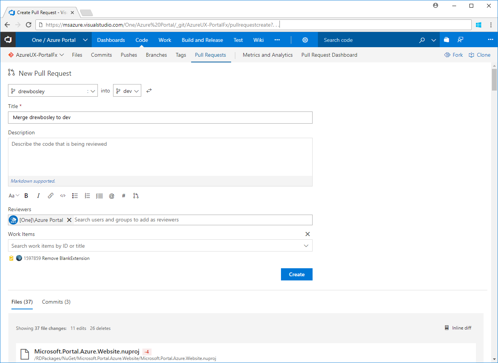

## Sending pull requests for portal extensions

The Portal repository has four branches: `dev`, `Dogfood`, `MPAC`, and `PROD`. Pull requests are used to cherry-pick extension configurations from one branch to the next one by updating the configuration files that govern each environment. This document hypothesizes that the extension has been completely developed and tested, and is ready to be moved to the next branch, as specified in [portalfx-extensions-branches.md](portalfx-extensions-branches.md). The scope of this document is the extension configuration files in the portal repository; the source code for the extension is out of the scope of this document.

The configuration file for the extension that will be cherry-picked should be similar to the examples in [portalfx-extensions-configuration-overview.md](portalfx-extensions-configuration-overview.md). The relationship between the environments and the configuration files specified in [portalfx-extensions-branches.md](portalfx-extensions-branches.md).

 For permission to send pull requests, developers should join the **Azure Portal Core Team - 15003(15003)** group as specified in [portalfx-extensions-forDevelopers-procedures.md#join-dls-and-request-permissions](portalfx-extensions-forDevelopers-procedures.md#join-dls-and-request-permissions).

All the pull requests should be sent first to the dev branch. To add or update or your extension's configuration, use the following process to send a pull request to the reviewers that you can specify in the request.

1. Open or locate the associated bug at [http://aka.ms/portalfx/exec/bug](http://aka.ms/portalfx/exec/bug). Then use the bug ID and bug title in the commit message and in the description of the pull request. You may want to add a description of the solution to the pull request.

1. In the framework repository, the extension configuration files for all Portal environments are located at `<RepoRoot>\RDPackages\OneCloud`, where `<RepoRoot>` is the root of the repository.  The developer can communicate with the remote repository by setting up a local git repository. To manage the extension's configuration, make a clone by using the following commands at the command line.

   ```js
    git clone https://msazure.visualstudio.com/DefaultCollection/One/_git/AzureUX-PortalFx
    cd AzureUX-PortalFx\
    git checkout dev
    init.cmd
    REM  The following directory contains the Environment.*.json files to which to add or update the extension
    cd <RepoRoot>\RDPackages\OneCloud
  
    REM   fetch down all the branches from the Git remote
    git fetch
   ```
    
    When these commands complete successfully, the developer has a clone of the Portal configuration directories.

1.  The developer may need to modify the configuration file(s) to enable the extension, as specified in [portalfx-extensions-configuration-scenarios.md#managing-the-configuration-of-the-extension](portalfx-extensions-configuration-scenarios.md#managing-the-configuration-of-the-extension). The modified configuration files would then be staged, committed, and pushed to the developer's remote repository.

    **NOTE**: There should be one config file for every environment that will be affected by the pull request for this extension.

1.  Stage the changes in the local git repository so that the pull request will pick them up from the remote repository, as described in [https://git-scm.com/book/en/v2/Git-Basics-Working-with-Remotes](https://git-scm.com/book/en/v2/Git-Basics-Working-with-Remotes). Remember to include the bug ID or work item ID in the custom commit message. The commands for the staging process are as follows.

     ```js
    REM   Checkout file, then add them to the next commit for staging
    git checkout -b myalias/extensionupdate

    REM   Commit the staged content. 
    git add <Modified_Extension.*.json_Files>
        
    REM   Include the Bug ID or Work Item ID in the custom commit message immediately after the pound sign.
    REM     Save the commit hash that is returned from this command for later reference.
    REM     The build will break immediately if the commit message is not well-formed 
    TEM       The developer will get a notification to update the commit message.
    git commit -m "#1234567 Add/ Enable the extension"

    REM   Transmit local branch commits to the remote repository branch
    git push origin myalias/extensionupdate

    cd %ROOT%\src\
    buildall

    REM   Test if all the test cases passed. If any test case fails,
    REM     re-verify the config
    testconfig 
     ```

    The build will break immediately if the commit message is in a different format, and the developer will get a notification to update the commit message.

    **NOTE**:  Use the commit hash that was returned from the previous `git commit` command. It can also be found on the site that is located at [https://msazure.visualstudio.com/One/_git/AzureUX-PortalFx/commits](https://msazure.visualstudio.com/One/_git/AzureUX-PortalFx/commits).

1. Create a work item so that you can associate the work item with the commit. Use the site located at [https://aka.ms/portalfx/pullRequest](https://aka.ms/portalfx/pullRequest) to create the work item. Click the `New pull request` button, then select the branch that contains the staged changes in the first dropdown box.  Select the target branch in the second dropdown box. In the following example, the developer is requesting to move configuration changes from their `extensionupdate` branch to the `dev` branch.

   

1. The work item description should include information about the commit and any other items that the Ibiza team may need to update the portal environment configuration files. Validate that the branches and reviewers are accurate, then click the `Create` button to email the pull request to the reviewers.

1. The Ibiza team will review the pull request to ensure that the changes you have made are correct and will not cause any live-site issues.  If the pull request successfully passes the review, they will complete it.  A list of Ibiza team contacts to select as reviewers is located at [portalfx-extensions-contacts.md](portalfx-extensions-contacts.md).  

When the changes are successfully deployed in any environment, the developer will receive an email.