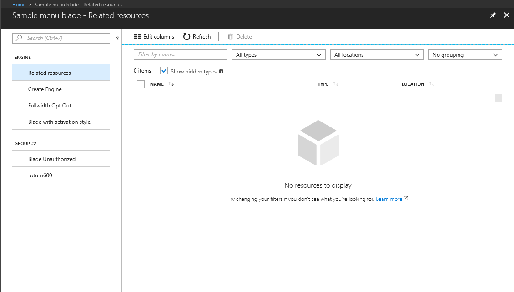

## Menu Blade

Menu blades are rendered as a menu on the left side of the screen. The Shell combines this blade with the blade that is immediately to its right. Each item that is referenced from the left menu is rendered using the same header as the menu blade, resulting in the two blades being displayed as one blade.  This is similar to the way that the resource menu blade operates.

The process is as follows.

1. The menu blade is displayed as a menu, or list of items that open blades when clicked
1. The menu blade is rendered to the left of the screen
1. The blades that are opened from the menu share the chrome with the menu blade 

**NOTE**: In this discussion, `<dir>` is the `SamplesExtension\Extension\` directory, and  `<dirParent>`  is the `SamplesExtension\` directory, based on where the samples were installed when the developer set up the SDK. If there is a working copy of the sample in the Dogfood environment, it is also included.

Menu blades are defined in a **TypeScript** file as shown in the following code. The code is also located at `<dir>/Client/V2/Blades/MenuBlade/SampleMenuBlade.ts`.

The following code demonstrates how to define a menu blade `ViewModel` to open two different items.

 {"gitdown": "include-file", "file": "../Samples/SamplesExtension/Extension/Client/V2/Blades/MenuBlade/SampleMenuBlade.ts"}
 

 
There are a few things to notice in the preceding code.

* Menus have an overview item. This item is the default selected item when the user loads the menu blade.
* Menu items `id` property is required to be unique, this will also be used in the deep link of your menu blade.
* Menus can have different groups. In this code there is a single group.
* Each menu item opens a blade, and all necessary parameters are provided.
* The menu blade ideally should not be loading data. That can be done on the child blade after the user opens the blade.

You can view a working copy of the MenuBlade  in the Dogfood environment sample located at [https://df.onecloud.azure-test.net/?SamplesExtension=true#blade/SamplesExtension/PdlSampleMenuBlade/browserelated](https://df.onecloud.azure-test.net/?SamplesExtension=true#blade/SamplesExtension/PdlSampleMenuBlade/browserelated).

### Optional functionality

* Dynamically changing the default selected item

    If on load you want to take the user to a different menu item by default, you can specify the `defaultId` as part of the constructor options.

* Hide the search box

    If you want to hide the search box that is shown by default, you can set the `showSearch` property to `false`.

* Menu items should also define keywords. When a user searches within the menu blade's search box, the item's `displayText` and the keywords are used to match the search terms.

* Menu items can be made to be enabled or visible dynamically.

    You can define the `menuItem` and then provide an optional property for the enabled property or the visible property. Then, dynamically update the observable.

* Menu items can also provide a tooltip

    Tooltips can be used to display further information on what the menu item defines, or they can also be used to explain to the user why the menu item is disabled. For example, a tooltip for a disabled menu item might indicate that the user does not have access to that menu item.

Menu blades also allow the user to collapse the menu pane. This is not available for developers to control programmatically.

 A user can click on the double left arrow to collapse the menu pane, as in the following image.
 
